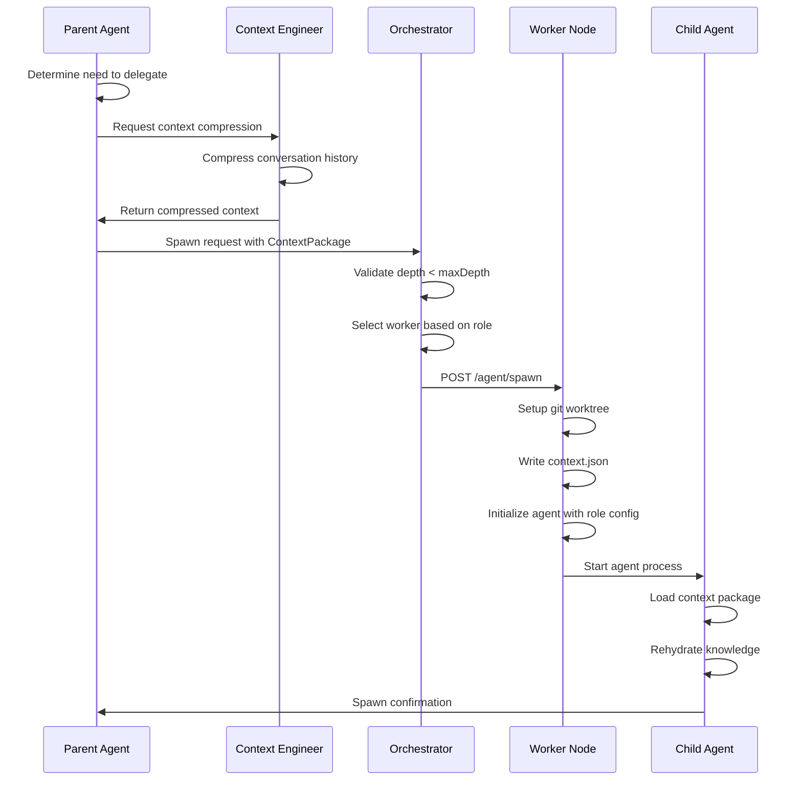

# Agent Orchestration Protocol

## Overview

A configurable, recursive agent delegation system with formal handover protocols and context engineering.

## Key Capabilities

1. **Configurable Agents**: Any provider/model combination per role
2. **Context Rehydration**: Full context restoration on agent spawn
3. **Formal Handover**: Structured exchange between agents
4. **Recursive Delegation**: Subagents can spawn sub-subagents
5. **Context Engineering**: Automatic compression and optimization

## Configuration System

### Role Definitions

```yaml
# .rover/agents.yaml
version: "2.0"

providers:
  anthropic:
    baseUrl: https://api.anthropic.com
    defaultTimeout: 120000
  openai:
    baseUrl: https://api.openai.com
    defaultTimeout: 60000
  google:
    baseUrl: https://generativelanguage.googleapis.com
    defaultTimeout: 90000

roles:
  director:
    description: "Project-wide planning and coordination"
    defaultProvider: anthropic
    defaultModel: claude-opus-4-6
    maxTokens: 200000
    temperature: 0.3
    capabilities:
      - decompose
      - delegate
      - review
      - orchestrate
    
  architect:
    description: "Detailed module design"
    defaultProvider: anthropic
    defaultModel: claude-sonnet-4-6
    maxTokens: 100000
    temperature: 0.2
    capabilities:
      - design
      - document
      - specify
      
  implementer:
    description: "Code implementation"
    defaultProvider: openai
    defaultModel: gpt-4-turbo
    maxTokens: 80000
    temperature: 0.1
    capabilities:
      - code
      - refactor
      - document
      
  tester:
    description: "Testing and verification"
    defaultProvider: anthropic
    defaultModel: claude-haiku-4-5
    maxTokens: 40000
    temperature: 0.1
    capabilities:
      - test
      - lint
      - analyze
      
  contextEngineer:
    description: "Context compression and memory management"
    defaultProvider: anthropic
    defaultModel: claude-haiku-4-5
    maxTokens: 50000
    temperature: 0.2
    capabilities:
      - compress
      - summarize
      - extract

# Runtime overrides per project
projects:
  fpx-laureline:
    roles:
      implementer:
        provider: anthropic  # Override: use Claude instead of OpenAI
        model: claude-sonnet-4-6
        reasoningEffort: high
```

## Context Package

The universal container for agent state:

```typescript
interface ContextPackage {
  version: "2.0";
  
  // Identity
  sessionId: string;
  parentSessionId?: string;  // For recursive delegation
  depth: number;             // Delegation depth (0 = Director)
  
  // Task Definition
  task: {
    id: string;
    type: "plan" | "design" | "implement" | "test" | "custom";
    description: string;
    requirements: string[];
    constraints: string[];
    acceptanceCriteria: string[];
  };
  
  // Role Assignment
  role: {
    name: string;
    provider: string;
    model: string;
    capabilities: string[];
  };
  
  // Knowledge Base
  knowledge: {
    // Compressed context from previous agents
    summary: string;
    
    // Key decisions made upstream
    decisions: Decision[];
    
    // Relevant memories
    memories: MemoryRef[];
    
    // Files to read
    files: FileRef[];
    
    // External resources
    links: LinkRef[];
  };
  
  // Workspace
  workspace: {
    repo: string;
    branch: string;
    commit: string;
    files: string[];
  };
  
  // History
  history: {
    // Previous agents in this chain
    chain: AgentStep[];
    
    // Total tokens used so far
    tokensUsed: number;
    
    // Time elapsed
    elapsedMs: number;
  };
  
  // Handover Configuration
  handover: {
    // When to return control
    completionCriteria: string[];
    
    // When to escalate
    escalationTriggers: string[];
    
    // When to delegate further
    delegationThreshold: {
      maxComplexity: number;  // 1-10
      maxLines: number;
      maxFiles: number;
    };
    
    // Context engineer involvement
    compressionTrigger: {
      tokenThreshold: number;
      compressionRatio: number;
    };
  };
  
  // Metadata
  createdAt: string;
  expiresAt?: string;
}

interface Decision {
  id: string;
  agent: string;
  timestamp: string;
  context: string;
  decision: string;
  rationale: string;
  alternatives: string[];
}

interface AgentStep {
  role: string;
  provider: string;
  model: string;
  startTime: string;
  endTime: string;
  tokensIn: number;
  tokensOut: number;
  summary: string;
  output: string;
}
```

## Agent Lifecycle

### 1. Spawn Protocol



### 2. Context Rehydration

```typescript
async function rehydrateContext(pkg: ContextPackage): Promise<AgentState> {
  // 1. Load role configuration
  const roleConfig = await loadRoleConfig(pkg.role.name);
  
  // 2. Initialize LLM client
  const llm = createLLMClient({
    provider: pkg.role.provider,
    model: pkg.role.model,
    maxTokens: roleConfig.maxTokens,
    temperature: roleConfig.temperature
  });
  
  // 3. Build system prompt
  const systemPrompt = buildSystemPrompt({
    role: pkg.role,
    task: pkg.task,
    knowledge: pkg.knowledge,
    history: pkg.history
  });
  
  // 4. Prepare conversation history
  const messages = [
    { role: "system", content: systemPrompt },
    ...decompressHistory(pkg.history.chain),
    { role: "user", content: formatTaskPrompt(pkg.task) }
  ];
  
  // 5. Load relevant files into context
  const fileContents = await loadFiles(pkg.workspace.files);
  
  // 6. Initialize tool registry
  const tools = loadToolsForRole(pkg.role.capabilities);
  
  return { llm, messages, fileContents, tools };
}
```

### 3. Handover Protocol

```typescript
interface HandoverRequest {
  // What was accomplished
  completed: {
    summary: string;
    deliverables: Deliverable[];
    filesChanged: FileChange[];
    testsAdded: string[];
    documentation: string;
  };
  
  // What remains
  remaining: {
    items: string[];
    reason: string;  // Why not completed
    recommendation: string;
  };
  
  // State for next agent
  state: {
    currentFile?: string;
    currentFunction?: string;
    openQuestions: string[];
    blockers: string[];
  };
  
  // Knowledge transfer
  knowledge: {
    keyLearnings: string[];
    pitfalls: string[];
    patterns: string[];
  };
  
  // Metrics
  metrics: {
    tokensUsed: number;
    timeElapsed: number;
    complexity: number;
  };
}

async function executeHandover(
  child: AgentSession,
  parent: AgentSession,
  contextEngineer: ContextEngineer
): Promise<void> {
  // 1. Child prepares handover package
  const handover = await child.prepareHandover();
  
  // 2. Context engineer reviews and optimizes
  const optimized = await contextEngineer.optimize(handover, {
    targetTokens: 4000,
    preserveDecisions: true,
    preserveCode: true
  });
  
  // 3. Child transfers control
  await child.transferControl(parent.sessionId, optimized);
  
  // 4. Parent receives and acknowledges
  await parent.receiveHandover(child.sessionId, optimized);
  
  // 5. Context engineer archives full conversation
  await contextEngineer.archive(child.sessionId, {
    compress: true,
    extractPatterns: true
  });
}
```

## Recursive Delegation

### Manager Mode

When a subagent detects a task is too large:

```typescript
interface DelegationCheck {
  complexity: number;      // Estimated 1-10
  estimatedLines: number;
  estimatedFiles: number;
  canComplete: boolean;
  recommendation: "proceed" | "delegate" | "escalate";
}

class AgentSession {
  async checkDelegationNeeded(): Promise<DelegationCheck> {
    const analysis = await this.analyzeTaskSize();
    const config = this.context.handover.delegationThreshold;
    
    if (analysis.complexity > config.maxComplexity ||
        analysis.estimatedLines > config.maxLines ||
        analysis.estimatedFiles > config.maxFiles) {
      return {
        ...analysis,
        canComplete: false,
        recommendation: "delegate"
      };
    }
    
    return { ...analysis, canComplete: true, recommendation: "proceed" };
  }
  
  async enterManagerMode(): Promise<void> {
    // Switch from implementer to sub-director role
    this.role = "sub-director";
    this.mode = "orchestrator";
    
    // Decompose task further
    const subtasks = await this.decomposeTask();
    
    // Spawn sub-agents for each subtask
    for (const subtask of subtasks) {
      await this.spawnSubAgent(subtask);
    }
    
    // Coordinate results
    await this.coordinateSubAgents();
  }
  
  async spawnSubAgent(subtask: Task): Promise<AgentSession> {
    // Create context package for subtask
    const subContext: ContextPackage = {
      ...this.context,
      sessionId: generateId(),
      parentSessionId: this.context.sessionId,
      depth: this.context.depth + 1,
      task: subtask,
      role: this.selectRoleForSubtask(subtask),
      knowledge: {
        summary: this.context.knowledge.summary,
        decisions: this.context.knowledge.decisions,
        memories: this.selectRelevantMemories(subtask),
        files: this.selectRelevantFiles(subtask),
        links: []
      },
      history: {
        chain: [...this.context.history.chain, {
          role: this.role,
          provider: this.context.role.provider,
          model: this.context.role.model,
          startTime: this.startTime,
          endTime: new Date().toISOString(),
          tokensIn: this.tokensIn,
          tokensOut: this.tokensOut,
          summary: `Delegated to sub-agent for: ${subtask.description}`,
          output: "See sub-agent session"
        }],
        tokensUsed: this.context.history.tokensUsed + this.tokensUsed,
        elapsedMs: this.context.history.elapsedMs + this.elapsedTime
      }
    };
    
    // Request spawn from orchestrator
    return await orchestrator.spawnAgent(subContext);
  }
}
```

### Max Depth Protection

```typescript
const MAX_DELEGATION_DEPTH = 3;  // Director → Sub → Sub-Sub

async function spawnAgent(context: ContextPackage): Promise<AgentSession> {
  if (context.depth >= MAX_DELEGATION_DEPTH) {
    throw new DelegationDepthExceeded(
      `Cannot delegate beyond depth ${MAX_DELEGATION_DEPTH}. ` +
      `Task must be completed by current agent.`
    );
  }
  
  // Continue with spawn...
}
```

## Context Engineer Integration

### Automatic Compression Triggers

```typescript
interface CompressionTrigger {
  tokenThreshold: number;    // e.g., 100k tokens
  ratio: number;             // Target compression ratio
  strategy: "summarize" | "extract" | "hybrid";
}

class ContextEngineer {
  async shouldCompress(session: AgentSession): Promise<boolean> {
    const trigger = session.context.handover.compressionTrigger;
    const currentTokens = await session.estimateTokens();
    
    return currentTokens > trigger.tokenThreshold;
  }
  
  async compress(session: AgentSession): Promise<CompressedContext> {
    const strategy = this.selectStrategy(session);
    
    switch (strategy) {
      case "summarize":
        return this.summarizeConversation(session);
      case "extract":
        return this.extractKeyPoints(session);
      case "hybrid":
        return this.hybridCompression(session);
    }
  }
  
  private async hybridCompression(session: AgentSession): Promise<CompressedContext> {
    // Keep full recent conversation (last N messages)
    const recent = session.messages.slice(-10);
    
    // Summarize older conversation
    const older = session.messages.slice(0, -10);
    const summary = await this.summarize(older);
    
    // Extract key decisions
    const decisions = await this.extractDecisions(session);
    
    // Keep code blocks verbatim
    const codeBlocks = this.extractCodeBlocks(session);
    
    return {
      recentMessages: recent,
      summary,
      decisions,
      codeBlocks,
      originalTokens: session.estimateTokens(),
      compressedTokens: this.estimateCompressedTokens(recent, summary, decisions, codeBlocks),
      compressionRatio: this.calculateRatio()
    };
  }
}
```

## Implementation: Worker Protocol

### Worker Endpoints

```typescript
// POST /agent/spawn
interface SpawnRequest {
  contextPackage: ContextPackage;
}

interface SpawnResponse {
  sessionId: string;
  workerId: string;
  status: "spawning" | "ready" | "error";
  websocketUrl?: string;  // For real-time updates
}

// POST /agent/:sessionId/handover
interface HandoverRequest {
  fromSessionId: string;
  handoverPackage: HandoverPackage;
}

// GET /agent/:sessionId/status
interface StatusResponse {
  sessionId: string;
  status: "idle" | "working" | "waiting_handover" | "completed" | "error";
  progress?: number;
  currentTask?: string;
  tokensUsed: number;
  canAcceptHandover: boolean;
}

// POST /agent/:sessionId/delegate
interface DelegateRequest {
  subtask: Task;
  role: string;
}

interface DelegateResponse {
  childSessionId: string;
  status: "delegated" | "depth_exceeded" | "error";
}
```

### Worker State Machine

```
SPAWNED → REHYDRATING → READY → WORKING → PREPARING_HANDOVER → COMPLETED
                                          ↓
                                     WAITING_FOR_ACK
                                          ↓
                                     HANDED_OVER

WORKING → DELEGATING → COORDINATING → PREPARING_HANDOVER
            ↓
     CHILD_SPAWNED
```

## Dashboard Integration

### Agent Chain Visualization

```
Session: sess-abc123
Depth 0: Director (Opus) [COMPLETED] ──> spawned
  │
  └── Depth 1: Architect (Sonnet) [COMPLETED] ──> spawned
        │
        └── Depth 2: Implementer (GPT-4) [WORKING]
              │
              ├── Depth 3: Helper (Haiku) [WORKING] ──> delegated
              └── Depth 3: Helper (Haiku) [IDLE] ──> delegated
```

### Context Package Inspector

View the full context package for any agent:
- Task definition
- Knowledge base
- Workspace files
- History chain
- Handover configuration

## Configuration Examples

### Example 1: Anthropic-Only Setup

```yaml
roles:
  director:
    provider: anthropic
    model: claude-opus-4-6
  
  architect:
    provider: anthropic
    model: claude-sonnet-4-6
  
  implementer:
    provider: anthropic
    model: claude-sonnet-4-6
  
  tester:
    provider: anthropic
    model: claude-haiku-4-5
```

### Example 2: Mixed Provider Setup

```yaml
roles:
  director:
    provider: anthropic
    model: claude-opus-4-6
  
  architect:
    provider: openai
    model: gpt-4-turbo
  
  implementer:
    provider: google
    model: gemini-pro
  
  tester:
    provider: anthropic
    model: claude-haiku-4-5
```

### Example 3: Override for Specific Task

```yaml
# In WBS node
- id: mod-ml
  name: "Machine Learning Module"
  role: implementer
  override:
    provider: openai
    model: gpt-4-turbo
    reasoningEffort: maximum
```

## Error Handling

### Spawn Failures

```typescript
enum SpawnError {
  DEPTH_EXCEEDED = "depth_exceeded",
  NO_AVAILABLE_WORKERS = "no_workers",
  MODEL_UNAVAILABLE = "model_unavailable",
  CONTEXT_TOO_LARGE = "context_too_large",
  INVALID_ROLE = "invalid_role"
}

async function handleSpawnError(error: SpawnError): Promise<void> {
  switch (error) {
    case SpawnError.DEPTH_EXCEEDED:
      // Current agent must complete task
      await currentAgent.markAsMustComplete();
      break;
      
    case SpawnError.NO_AVAILABLE_WORKERS:
      // Queue and retry
      await queueForRetry(contextPackage, { delay: 30000 });
      break;
      
    case SpawnError.MODEL_UNAVAILABLE:
      // Fallback to alternative model
      const fallback = getFallbackModel(contextPackage.role);
      await spawnWithModel(contextPackage, fallback);
      break;
      
    case SpawnError.CONTEXT_TOO_LARGE:
      // Pre-compress before spawn
      const compressed = await contextEngineer.compress(contextPackage);
      await spawnWithCompressed(compressed);
      break;
  }
}
```

## Migration Path

From current system to Agent Orchestration Protocol:

1. **Phase 1**: Add configuration layer (`agents.yaml`)
2. **Phase 2**: Implement ContextPackage format
3. **Phase 3**: Add handover endpoints to workers
4. **Phase 4**: Implement recursive delegation
5. **Phase 5**: Full Context Engineer integration

## Open Questions

1. **Real-time Updates**: WebSocket or polling for agent status?
2. **Context Versioning**: How to track context package schema versions?
3. **Security**: How to handle credentials for multiple providers?
4. **Cost Optimization**: Should cheaper models be preferred for simple tasks?
5. **Human-in-the-Loop**: Where should humans approve handovers?