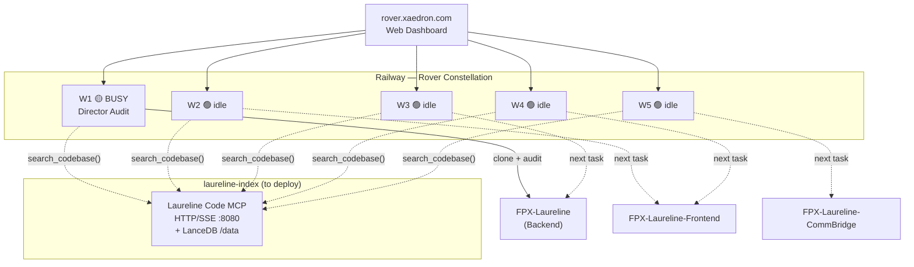

# FPX-Laureline × Rover Constellation — Full Plan

## 🚀 STATUS: Director Audit Dispatched
- **Task ID**: `7bbfbdbe-76cb-41ce-a7d8-4491ce62e20e`
- **Worker**: `rover-worker-1` (W1 now amber/busy)
- **Branch**: `rover/director-audit-20260320`
- **ETA**: ~5-15 min (clone + read docs + write audit + push)

---

## 📋 Project Context

**FPX-Laureline** — AI-powered Business Center management system for FPX Coworking
- **Stack**: Django/Python (Backend), Next.js/TypeScript (Frontend), LangGraph (LLM), WhatsApp bridge (CommBridge)
- **Status**: **92% complete**, Phase 8 (Frontend Consolidation) in progress
- **4 repos**: all private, same GitHub account

### What's Left (Phase 8)
| Item | Repo | Status |
|------|------|--------|
| `api/ops/roster` endpoint | Backend | ❓ Verify if exists |
| `api/points/top-up` endpoint | Backend | ❓ Verify if exists |
| BookingModal bugs (6 bugs) | Frontend | In progress |
| CafeOrderModal (new) | Frontend | Not started |
| Guest Management UI | Frontend | Not started |
| Onboarding Flow | Frontend | Not started |
| CommBridge status | CommBridge | Unknown |
| LLM service status | LLM | Unknown |

---

## 🏗️ Laureline-Code MCP — Deployment Plan

### What It Is
A Python LanceDB semantic search server that indexes all 4 repos and gives workers [search_codebase](file:///C:/Users/jssca/CascadeProjects/FPX%20Laureline%20Backend/documentation/lancedb/mcp/laureline_mcp/server.py#369-421), [similar_files](file:///C:/Users/jssca/CascadeProjects/FPX%20Laureline%20Backend/documentation/lancedb/mcp/laureline_mcp/server.py#654-723), and [get_chunk_by_ref](file:///C:/Users/jssca/CascadeProjects/FPX%20Laureline%20Backend/documentation/lancedb/mcp/laureline_mcp/server.py#581-612) tools. Currently stdio-only.

### The Problem
- Claude Code CLI uses `--mcp-config mcp.json` for MCP servers
- `mcp.json` can specify **stdio** servers: `{"command": "python", "args": ["run_server.py"]}`
- But workers run on Railway Linux — they'd need Python + deps + the pre-built index
- Each worker would have to re-download the 500MB embedding model on every task!

### Solution: Deploy as HTTP/SSE MCP Service on Railway

Add an HTTP wrapper to the existing stdio server using the `mcp` Python SDK's built-in Streamable HTTP transport. Workers connect to it over Railway private networking.

```
┌─────────────────────────────────────────────┐
│  Railway Private Network                    │
│                                             │
│  laureline-index service                    │  ← new Railway service
│  http://laureline-index.railway.internal    │
│  Port 8080, Python + LanceDB + pre-indexed  │
│                                             │
│  ├── rover-worker-1  ──────────────────────→│  search_codebase("...")
│  ├── rover-worker-2  ──────────────────────→│  get_chunk_by_ref(...)
│  ├── rover-worker-3  ──────────────────────→│
│  ├── rover-worker-4  ──────────────────────→│
│  └── rover-worker-5  ──────────────────────→│
└─────────────────────────────────────────────┘
```

### Implementation Steps

**Step 1**: Add HTTP wrapper to `FPX-Laureline-Index` repo
- Install `mcp[cli]>=1.5.0` and `fastapi`, `uvicorn`
- Wrap the existing [MCPServer](file:///C:/Users/jssca/CascadeProjects/FPX%20Laureline%20Backend/documentation/lancedb/mcp/laureline_mcp/server.py#35-778) class with FastAPI's SSE endpoint
- Workers use: `{"url": "http://laureline-index.railway.internal:8080/sse"}`

**Step 2**: Add `REPO_ROOT` support for cloned repos
- When workers clone and index a repo at task time, they call [reindex_repo](file:///C:/Users/jssca/CascadeProjects/FPX%20Laureline%20Backend/documentation/lancedb/mcp/laureline_mcp/server.py#289-368) tool
- The index service maintains the LanceDB store between calls (persistent Railway volume)
- Workers pass the cloned repo path on their own filesystem → **won't work cross-service**

> [!WARNING]
> **Key Architecture Decision Needed**:
> The [reindex_repo](file:///C:/Users/jssca/CascadeProjects/FPX%20Laureline%20Backend/documentation/lancedb/mcp/laureline_mcp/server.py#289-368) tool takes a *local filesystem path* — it can't index a repo that's on a different machine. Two options:

**Option A — Index service does its own cloning** (recommended)
- Deploy `laureline-index` as a Railway service with GITHUB_TOKEN
- Add a `clone_and_index(repo_url, branch)` endpoint
- Service clones repos to its own `/data/repos/` volume, indexes them, serves searches
- Workers just call [search_codebase(query)](file:///C:/Users/jssca/CascadeProjects/FPX%20Laureline%20Backend/documentation/lancedb/mcp/laureline_mcp/server.py#369-421) — no local path needed
- Pre-index all 4 repos at deployment time via startup script

**Option B — Workers embed the MCP as stdio, share a Railway Volume**
- Mount the same Railway Volume to all workers and the index service
- Workers run the MCP server locally via stdio, reading shared volume
- More complex, volume limits apply

**→ Recommendation: Option A** — deploy as a self-contained HTTP service that manages its own clones.

### `FPX-Laureline-Index` Railway Service Spec

```yaml
# Proposed structure for the Railway service
Name: laureline-index
Port: 8080
Start command: python server_http.py
Environment variables:
  - GITHUB_TOKEN: (same token)
  - EMBED_DB_PATH: /data/lancedb     # Railway persistent volume
  - REPOS: |
      https://github.com/jsscarfo/FPX-Laureline
      https://github.com/jsscarfo/FPX-Laureline-Frontend
      https://github.com/jsscarfo/FPX-Laureline-CommBridge
      https://github.com/jsscarfo/FPX-Laureline-LLM
  - AUTO_INDEX_ON_START: true        # Clone and index all repos on startup
  - ROVER_WEB_TOKEN: (auth token)
Volumes:
  - /data (persistent, 10GB+)
```

**New file to create**: `server_http.py` — FastAPI + SSE wrapper:
```python
# MCP over HTTP/SSE using FastAPI
from fastapi import FastAPI
from mcp.server.sse import SseServerTransport
from laureline_mcp.server import MCPServer
import uvicorn

app = FastAPI()
mcp_server = MCPServer()

@app.get("/sse")
async def sse_endpoint(request: Request):
    # MCP SSE transport
    ...

if __name__ == "__main__":
    uvicorn.run(app, host="0.0.0.0", port=8080)
```

### Worker MCP Config Integration
Once the service is deployed, workers receive this `mcp.json`:
```json
{
  "mcpServers": {
    "laureline-code": {
      "url": "http://laureline-index.railway.internal:8080/sse"
    },
    "playwright": {
      "command": "npx",
      "args": ["@playwright/mcp@latest"]
    }
  }
}
```

The worker's [server.js](file:///c:/Users/jssca/CascadeProjects/rover/packages/web/server.js) would write this file to the cloned repo directory and pass `--mcp-config mcp.json` to Claude Code.

---

## 🔄 Worker Dispatch Plan (After Audit)

Once the Director audit creates `ROVER_AUDIT.md`, dispatch these tasks:

| Worker | Repo | Task | Priority |
|--------|------|------|----------|
| W1 | `FPX-Laureline` | Backend: Implement `api/ops/roster` endpoint | P0 |
| W2 | `FPX-Laureline-Frontend` | Frontend: Fix BookingModal bugs (6 bugs) | P0 |
| W3 | `FPX-Laureline` | Backend: Implement `api/points/top-up` endpoint | P0 |
| W4 | `FPX-Laureline-Frontend` | Frontend: CafeOrderModal new component | P1 |
| W5 | `FPX-Laureline-CommBridge` | CommBridge: Audit & status check | P2 |

---

## ❓ 5 Workers vs 3: Should You Add More?

**Keep 5 for now.** Serverless means you only pay during active compute. With Phase 8 having ~10 distinct tasks across 4 repos, 5 workers gives you good parallelism without over-provisioning. You could add W6-W8 during heavy parallel phases but it's not necessary yet.

---

## 🎯 Immediate Next Steps

### Right Now (15-20 min — waiting for audit)
1. ✅ **Director audit dispatched** → Watch W1 badge in dashboard
2. 📍 **Check the drawer** → Click W1 amber badge to see live Claude logs

### After Audit Completes
3. **Read `ROVER_AUDIT.md`** from the `rover/director-audit-20260320` branch on GitHub
4. **Dispatch W1-W5 tasks** based on audit findings
5. **Playwright**: Add `--mcp-config` flag to worker [server.js](file:///c:/Users/jssca/CascadeProjects/rover/packages/web/server.js) (can do now or after)

### Laureline-Code MCP (Separate Track, ~2-3 hrs work)
6. **Build `server_http.py`** — HTTP/SSE wrapper for the MCP server
7. **Push to `FPX-Laureline-Index`** repo
8. **Deploy on Railway** as new service with persistent volume
9. **Update worker [server.js](file:///c:/Users/jssca/CascadeProjects/rover/packages/web/server.js)** to inject `mcp.json` with the index URL
10. **Re-index all 4 repos** via the startup script

---

## Architecture Diagram


