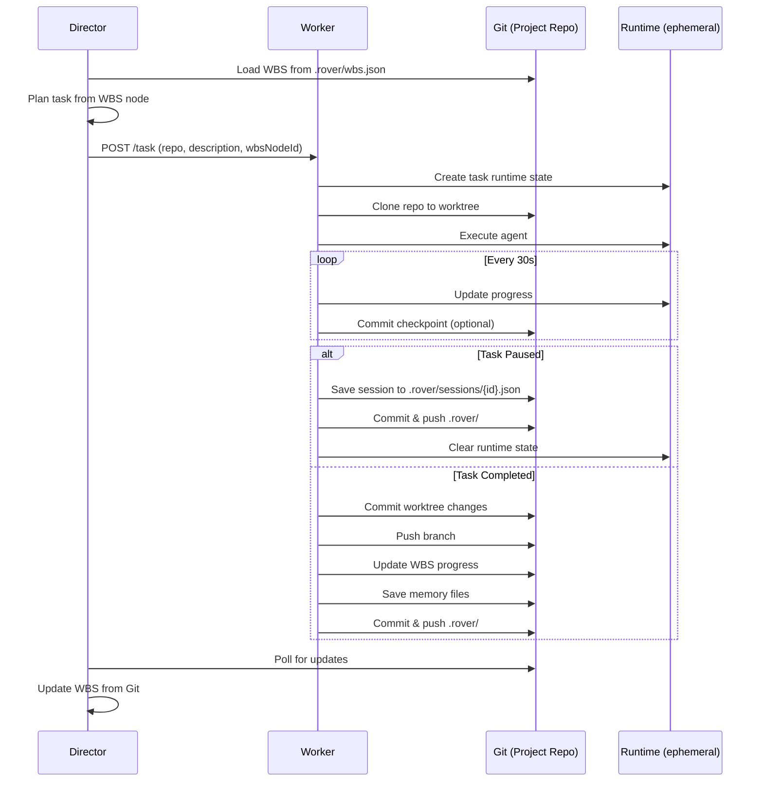

# Git-Centric Rover Architecture

## Problem Statement

The current Railway deployment has no persistent volumes configured, so worker task storage is lost on every restart. Rather than requiring Railway infrastructure changes, we pivot to using **Git as the source of truth** for all persistent data.

## Core Principles

1. **Git is the Database**: All persistent state lives in Git repositories
2. **Project-Owned Data**: Each project's WBS, memories, and task history live in that project's repo
3. **Separation of Concerns**: LLM memories and dev files are cleanly separated
4. **Runtime Ephemeral**: JSON/memory during execution, Git on completion
5. **Rehydratable**: Director can reconstruct full project state from Git on load

## Architecture Overview

```
┌─────────────────────────────────────────────────────────────────┐
│                    PROJECT REPOSITORY                            │
│  ┌──────────────┐  ┌──────────────┐  ┌──────────────────────┐  │
│  │  Source Code │  │  .rover/     │  │  .rover/wbs.json     │  │
│  │  (main)      │  │  (Rover data)│  │  (Work Breakdown)    │  │
│  └──────────────┘  ├──────────────┤  └──────────────────────┘  │
│                    │  memories/   │  ┌──────────────────────┐  │
│                    │  sessions/   │  │  .rover/manifest.json│  │
│                    │  contexts/   │  │  (Project manifest)  │  │
│                    └──────────────┘  └──────────────────────┘  │
└─────────────────────────────────────────────────────────────────┘
                              │
                              │ Clone / Branch
                              ▼
┌─────────────────────────────────────────────────────────────────┐
│                      WORKER EXECUTION                            │
│  ┌──────────────────────┐      ┌─────────────────────────────┐  │
│  │  Git Worktree        │      │  Runtime JSON (ephemeral)   │  │
│  │  rover/task/{id}     │──────│  Task state, logs, memory   │  │
│  └──────────────────────┘      │  (lost on restart - OK)     │  │
│                                └─────────────────────────────┘  │
└─────────────────────────────────────────────────────────────────┘
                              │
                              │ On Complete/Fail
                              ▼
┌─────────────────────────────────────────────────────────────────┐
│                    PERSIST TO GIT                                │
│  ┌──────────────────────┐  ┌────────────────────────────────┐  │
│  │  Commit worktree     │  │  Save to .rover/ on main       │  │
│  │  changes             │  │  - task summary                │  │
│  │                      │  │  - memory snapshot             │  │
│  │  Push branch         │  │  - WBS updates                 │  │
│  └──────────────────────┘  └────────────────────────────────┘  │
└─────────────────────────────────────────────────────────────────┘
```

## Directory Structure

### In Project Repository (main branch)

```
.rover/
├── .gitignore              # Ignore session temps, keep summaries
├── manifest.json           # Project metadata, Director config
├── wbs.json                # Work Breakdown Structure
├── config.yaml             # Rover project configuration
├── memories/               # Persistent agent memories
│   ├── global/             # Cross-task memories
│   │   ├── architecture.md
│   │   ├── patterns.md
│   │   └── decisions.md
│   └── tasks/              # Per-task memory (optional)
│       └── {task-id}/
│           ├── reasoning.md
│           ├── context.md
│           └── summary.md
├── sessions/               # Active/paused session state
│   └── {session-id}.json
└── contexts/               # Compressed context for rehydration
    └── {agent-id}.json
```

### GitIgnore Rules

```gitignore
# .rover/.gitignore
# Runtime/temp files (ephemeral)
sessions/*.tmp
sessions/*.lock
contexts/temp/

# Large logs (keep summaries only)
logs/
*.log

# But KEEP these:
!manifest.json
!wbs.json
!config.yaml
!memories/
!sessions/*.json
!contexts/*.json
```

## Data Formats

### 1. manifest.json

Project-level configuration and metadata.

```json
{
  "version": "1.0.0",
  "project": {
    "name": "fpx-laureline",
    "id": "fpx-laureline-2024",
    "createdAt": "2024-01-15T10:00:00Z",
    "mainRepo": "https://github.com/user/fpx-laureline",
    "secondaryRepos": [
      { "name": "backend", "url": "https://github.com/user/laureline-backend" },
      { "name": "frontend", "url": "https://github.com/user/laureline-frontend" }
    ]
  },
  "director": {
    "model": "claude-opus-4-6",
    "charter": "director-v1",
    "initializedAt": "2024-01-15T10:00:00Z"
  },
  "agents": {
    "opus": { "model": "claude-opus-4-6", "role": "architect" },
    "sonnet": { "model": "claude-sonnet-4-6", "role": "implementer" },
    "haiku": { "model": "claude-haiku-4-5", "role": "context-engineer" }
  },
  "stats": {
    "totalTasks": 47,
    "completedTasks": 42,
    "totalTokens": 2847293,
    "totalCost": 142.50
  }
}
```

### 2. wbs.json

Hierarchical Work Breakdown Structure with percentages.

```json
{
  "version": "1.0.0",
  "updatedAt": "2024-01-20T15:30:00Z",
  "root": {
    "id": "root",
    "title": "FPX-Laureline Phase 8",
    "description": "Frontend consolidation and feature completion",
    "status": "in-progress",
    "progress": 65,
    "assignedTo": null,
    "children": [
      {
        "id": "wbs-001",
        "title": "Backend API Consolidation",
        "description": "Merge CommBridge into Backend",
        "status": "completed",
        "progress": 100,
        "assignedTo": "worker-1",
        "taskRef": "rover/task/550e8400-e29b-41d4-a716-446655440000",
        "startedAt": "2024-01-15T10:00:00Z",
        "completedAt": "2024-01-16T14:30:00Z",
        "tokensUsed": 452000,
        "children": []
      },
      {
        "id": "wbs-002",
        "title": "Frontend Component Migration",
        "description": "Migrate to unified component library",
        "status": "in-progress",
        "progress": 45,
        "assignedTo": "worker-2",
        "taskRef": "rover/task/550e8400-e29b-41d4-a716-446655440001",
        "startedAt": "2024-01-18T09:00:00Z",
        "tokensUsed": 320000,
        "children": [
          {
            "id": "wbs-002-1",
            "title": "Button components",
            "status": "completed",
            "progress": 100,
            "assignedTo": "worker-3",
            "taskRef": "rover/task/...",
            "children": []
          },
          {
            "id": "wbs-002-2",
            "title": "Form components",
            "status": "in-progress",
            "progress": 30,
            "assignedTo": "worker-4",
            "taskRef": "rover/task/...",
            "children": []
          }
        ]
      }
    ]
  }
}
```

### 3. Session State (sessions/{id}.json)

Captures active or paused task state for rehydration.

```json
{
  "sessionId": "sess-550e8400-e29b-41d4-a716-446655440000",
  "taskId": "rover/task/550e8400-e29b-41d4-a716-446655440000",
  "status": "paused",
  "pausedAt": "2024-01-20T15:30:00Z",
  "agent": {
    "type": "claude",
    "model": "claude-opus-4-6",
    "conversationId": "conv-abc123"
  },
  "context": {
    "compressed": true,
    "originalTokens": 150000,
    "compressedTokens": 25000,
    "compressionRatio": 0.17,
    "summary": "Working on Button component migration...",
    "keyDecisions": [
      "Using shadcn/ui as base",
      "Theme tokens from design-system"
    ]
  },
  "workspace": {
    "branch": "rover/task/550e8400-e29b-41d4-a716-446655440000",
    "filesModified": ["src/components/Button.tsx", "src/theme/tokens.css"],
    "filesCreated": ["src/components/Button.test.tsx"]
  },
  "memory": {
    "reasoning": "memories/tasks/550e8400-e29b-41d4-a716-446655440000/reasoning.md",
    "context": "memories/tasks/550e8400-e29b-41d4-a716-446655440000/context.md"
  }
}
```

### 4. Memory Files

#### memories/global/architecture.md

```markdown
# Architecture Decisions

## 2024-01-15: Backend Consolidation
Decision: Merge CommBridge into main Backend repo
Rationale: Reduce deployment complexity, shared types
Agent: Opus
Task: rover/task/550e8400-e29b-41d4-a716-446655440000

## 2024-01-18: Frontend Component Strategy  
Decision: Use shadcn/ui with custom theme
Rationale: Rapid development, accessible, customizable
Agent: Opus
Task: rover/task/550e8400-e29b-41d4-a716-446655440001
```

#### memories/tasks/{id}/reasoning.md

```markdown
# Task: Button Component Migration

## Initial Analysis
The current Button component has:
- 3 different implementations (legacy, v2, mobile)
- Inconsistent props across versions
- No accessibility support

## Migration Strategy
1. Create base shadcn/ui button wrapper
2. Map existing props to new interface
3. Add deprecation warnings
4. Update consuming components

## Challenges Encountered
- Theme token mismatch (resolved by mapping layer)
- TypeScript strict mode issues (fixed in 550e8400)
```

## Workflow: Task Lifecycle with Git Persistence



## Rehydration on Director Startup

When the Director (or new worker) loads a project:

```javascript
async function loadProjectFromGit(repoUrl) {
  // 1. Clone or fetch main branch
  const repo = await cloneOrFetch(repoUrl);
  
  // 2. Load manifest
  const manifest = JSON.parse(
    await repo.readFile('.rover/manifest.json')
  );
  
  // 3. Load WBS
  const wbs = JSON.parse(
    await repo.readFile('.rover/wbs.json')
  );
  
  // 4. Find active sessions
  const sessions = await repo.listFiles('.rover/sessions/*.json');
  
  // 5. Check which sessions have running workers
  const activeWorkers = await pollWorkerStatus();
  
  // 6. Rebuild project state
  return {
    manifest,
    wbs,
    sessions: sessions.map(s => ({
      ...s,
      status: activeWorkers.includes(s.taskId) ? 'running' : 'orphaned'
    })),
    memories: await loadMemories(repo)
  };
}
```

## Dashboard Integration

### WBS Visualization

The dashboard fetches WBS from the project repo (not from workers):

```javascript
// GET /api/projects/:id/wbs
async function getProjectWBS(projectId) {
  const repo = getProjectRepo(projectId);
  const wbs = await repo.readFile('.rover/wbs.json');
  
  // Enrich with worker status
  const workers = await getWorkerStatus();
  
  return enrichWBSWithStatus(wbs, workers);
}
```

### Tree View Component

```
FPX-Laureline Phase 8 [65%]
├── Backend API Consolidation [100%] ✅ W1
│   └── rover/task/550e8400... [Completed]
├── Frontend Component Migration [45%] 🔄 W2
│   ├── Button components [100%] ✅ W3
│   ├── Form components [30%] 🔄 W4
│   │   └── Input, Select, Checkbox
│   └── Layout components [0%] ⏳
└── Documentation [10%] 🔄 W5
```

## Implementation Phases

### Phase 1: Foundation (Git Persistence)

1. Modify worker to save task summary to `.rover/` on complete
2. Commit and push `.rover/` changes to main branch
3. Dashboard reads WBS from Git instead of workers
4. Remove dependency on Railway volumes

### Phase 2: WBS Editor

1. Create WBS JSON schema
2. Add WBS editor to dashboard (tree view)
3. Allow creating tasks from WBS nodes
4. Auto-update WBS progress from task completion

### Phase 3: Memory System

1. Agent writes to `memories/` during task
2. Haiku context engineer compresses memories
3. Director reads memories for context
4. Memory search/retrieval API

### Phase 4: Pause/Resume

1. Save full session state to `sessions/{id}.json`
2. Context compression on pause
3. Rehydration on resume
4. Worker handoff (pause on W1, resume on W2)

## Cost Tracking

Track at multiple levels:

```json
// In wbs.json nodes
{
  "tokensUsed": 452000,
  "tokensInput": 380000,
  "tokensOutput": 72000,
  "costUSD": 13.56,
  "model": "claude-opus-4-6",
  "duration": 1800
}

// Roll up to parent nodes
```

## Open Questions

1. **Concurrency**: How to handle multiple Directors editing WBS simultaneously?
   - Option A: Git locking with retry
   - Option B: Last-write-wins with merge
   - Option C: Single Director per project (enforced)

2. **Large Files**: What if memories get too large?
   - Option A: Compress old memories
   - Option B: Summarize and archive
   - Option C: External storage (S3) with Git LFS

3. **Private Repos**: How to access private repos without exposing tokens?
   - Use GitHub App installation tokens
   - Short-lived, scoped to specific repos
   - Rotate automatically

## Next Steps

1. Review this design document
2. Decide on open questions
3. Create implementation plan for Phase 1
4. Begin implementation