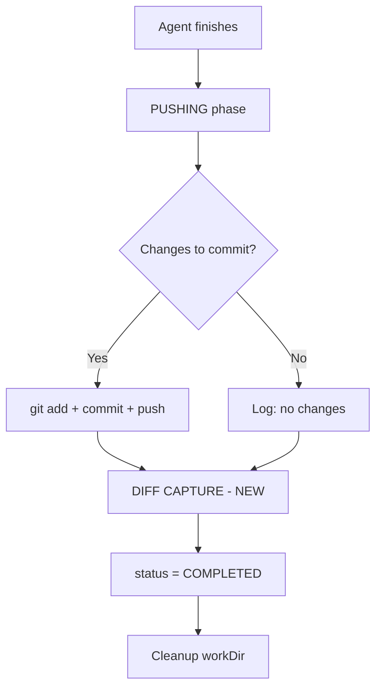
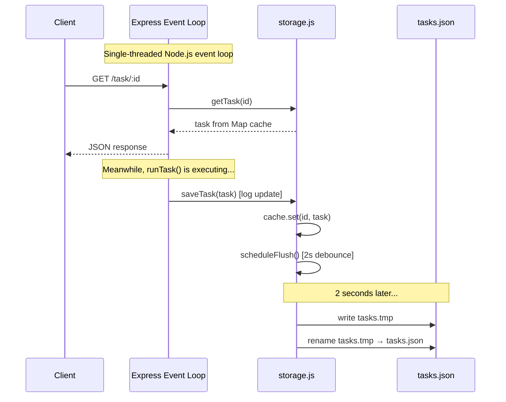
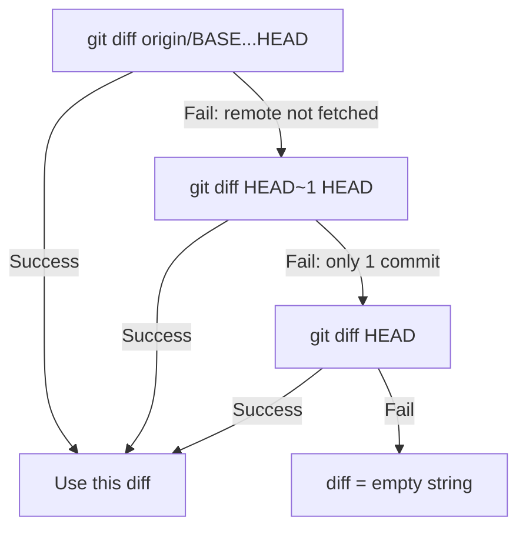

# P0/P1 Implementation Plan: Worker Persistent Storage & Diff Generation

## Summary

Two critical fixes for [`packages/worker/server.js`](packages/worker/server.js):

| Priority | Fix | Problem |
|----------|-----|---------|
| **P0** | Persistent Task Storage | `const tasks = new Map()` at [line 60](packages/worker/server.js:60) loses all data on container restart |
| **P1** | Diff Generation | Work directory is deleted via [`rmSync`](packages/worker/server.js:343) before capturing git diff; coordinator returns `{ diff: '' }` for all worker tasks ([web/server.js:363](packages/web/server.js:363)) |

---

## 1. Design Decision: JSON File Storage over SQLite

**Choice: Atomic JSON file writes** (write-to-temp → rename pattern)

| Factor | SQLite via `better-sqlite3` | JSON file with atomic writes |
|--------|---------------------------|------------------------------|
| Native compilation | Requires `python3`, `make`, `gcc` in Docker | None — pure JS |
| Dockerfile changes | Add `~200MB` build deps | None |
| Concurrent safety | Built-in WAL mode | Safe via rename atomicity + single-writer design |
| Complexity | Moderate (schema, migrations) | Low (read/write JSON) |
| Recovery | Excellent | Good — worst case: lose last write |
| Fits the worker model | Overkill for ~100 records | Perfect match |

**Rationale**: The worker processes one task at a time. Reads during writes are safe because Node.js is single-threaded — the JSON file is only written between event loop ticks. The rename-based atomic write ensures no partial reads from the filesystem. SQLite's advantages (transactions, concurrent writers) are unnecessary here.

---

## 2. Task Record Schema: Before and After

### Before (current — [lines 66-85](packages/worker/server.js:66))

```js
/**
 * @typedef {Object} TaskRecord
 * @property {string} id
 * @property {string} repo
 * @property {string} [branch]
 * @property {string} [worktreeBranch]
 * @property {string} [agent]
 * @property {string} [prompt]
 * @property {string} [model]
 * @property {string} [charter]
 * @property {object} [envVars]
 * @property {string} status
 * @property {string[]} logs
 * @property {number} startedAt
 * @property {number|null} completedAt
 * @property {number|null} failedAt
 * @property {string|null} error
 * @property {string|null} workDir
 * @property {import('child_process').ChildProcess|null} process  // runtime-only
 */
```

### After (proposed)

```js
/**
 * @typedef {Object} TaskRecord
 * @property {string} id
 * @property {string} repo
 * @property {string} [branch]
 * @property {string} [worktreeBranch]
 * @property {string} [agent]
 * @property {string} [prompt]
 * @property {string} [model]
 * @property {string} [charter]
 * @property {object} [envVars]
 * @property {string} description
 * @property {string} status
 * @property {string[]} logs
 * @property {number} startedAt
 * @property {number|null} completedAt
 * @property {number|null} failedAt
 * @property {string|null} error
 * @property {string|null} workDir          // runtime-only, NOT persisted
 * @property {string} diff                  // NEW — captured git diff output
 * @property {boolean} diffTruncated        // NEW — true if diff exceeded 1MB
 * @property {import('child_process').ChildProcess|null} process  // runtime-only, NOT persisted
 */
```

**New fields:**
- [`diff`](packages/worker/server.js) — `string`, defaults to `''`. Populated before work directory cleanup.
- [`diffTruncated`](packages/worker/server.js) — `boolean`, defaults to `false`. Set to `true` when diff exceeds 1MB limit.

**Fields excluded from persistence:**
- `process` — runtime child process handle, always `null` on load
- `workDir` — runtime temp directory path, always `null` on load

---

## 3. Storage Layer API Design

A new module [`packages/worker/storage.js`](packages/worker/storage.js) encapsulates all persistence logic. The main [`server.js`](packages/worker/server.js) imports it and replaces direct `Map` operations.

### Module Interface

```js
// storage.js — JSON file-backed task storage with in-memory cache

/**
 * Initialize storage: load existing tasks from disk into memory.
 * Creates the storage directory if it doesn't exist.
 * @param {string} storagePath — directory path, e.g. '/data' or './data'
 */
export function initStorage(storagePath)

/**
 * Get a task by ID from the in-memory cache.
 * @param {string} id
 * @returns {TaskRecord|undefined}
 */
export function getTask(id)

/**
 * Get all tasks as an array (from in-memory cache).
 * @returns {TaskRecord[]}
 */
export function getAllTasks()

/**
 * Save a task (insert or update). Writes to memory and flushes to disk.
 * Triggers eviction if task count exceeds MAX_TASKS.
 * @param {TaskRecord} task
 */
export function saveTask(task)

/**
 * Delete a task by ID. Removes from memory and flushes to disk.
 * @param {string} id
 * @returns {boolean} — true if task existed
 */
export function deleteTask(id)

/**
 * Number of stored tasks.
 * @returns {number}
 */
export function taskCount()
```

### Internal Implementation Details

```
storage.js internals:

┌─────────────────────────────────────────────┐
│  In-Memory Cache: Map<string, TaskRecord>   │
│  (same shape as current `tasks` Map)        │
└──────────────────┬──────────────────────────┘
                   │ saveTask() / deleteTask()
                   ▼
┌─────────────────────────────────────────────┐
│  flushToDisk()                              │
│  1. Serialize tasks (excluding process,     │
│     workDir) to JSON                        │
│  2. Write to {storagePath}/tasks.tmp        │
│  3. Rename tasks.tmp → tasks.json           │
│     (atomic on POSIX / near-atomic on       │
│      overlayfs)                             │
└─────────────────────────────────────────────┘
```

### Serialization Rules

When writing to disk, each task record is serialized with these exclusions:

```js
function serializeTask(task) {
  const { process: _proc, workDir: _wd, ...rest } = task;
  return rest;
}
```

When loading from disk, runtime fields are restored to defaults:

```js
function deserializeTask(data) {
  return {
    ...data,
    process: null,
    workDir: null,
    // Ensure new fields have defaults for old records
    diff: data.diff ?? '',
    diffTruncated: data.diffTruncated ?? false,
  };
}
```

### Eviction Strategy

- **Maximum tasks**: 100 (configurable via `MAX_TASKS` env var)
- **Eviction order**: Oldest completed/failed tasks first (sorted by `completedAt` or `failedAt` ascending)
- **Never evict**: Tasks with status `ACCEPTED`, `CLONING`, `SETUP`, `RUNNING`, or `PUSHING` (active tasks)
- **Trigger**: On every [`saveTask()`](packages/worker/storage.js) call, after inserting the new record

```js
function evictIfNeeded() {
  if (cache.size <= MAX_TASKS) return;

  const evictable = getAllTasks()
    .filter(t => t.status === 'COMPLETED' || t.status === 'FAILED')
    .sort((a, b) => (a.completedAt || a.failedAt || 0) - (b.completedAt || b.failedAt || 0));

  while (cache.size > MAX_TASKS && evictable.length > 0) {
    const oldest = evictable.shift();
    cache.delete(oldest.id);
  }
}
```

### Flush Debouncing

To avoid excessive disk writes during rapid log appends (the [`log()`](packages/worker/server.js:110) function is called frequently during task execution), the flush is debounced:

- **Immediate flush**: On status transitions (`saveTask` when `status` changes) and on task creation/deletion
- **Debounced flush**: 2-second debounce for log-only updates during `RUNNING` status
- **Implementation**: A simple `setTimeout`/`clearTimeout` pattern with a `dirty` flag

```js
let flushTimer = null;
const FLUSH_DEBOUNCE_MS = 2000;

function scheduleFlush() {
  if (flushTimer) clearTimeout(flushTimer);
  flushTimer = setTimeout(() => {
    flushTimer = null;
    flushToDisk();
  }, FLUSH_DEBOUNCE_MS);
}

function flushNow() {
  if (flushTimer) clearTimeout(flushTimer);
  flushTimer = null;
  flushToDisk();
}
```

---

## 4. Exact Changes to `packages/worker/server.js`

### 4.1 — Imports (top of file)

Add import for the new storage module:

```js
import { initStorage, getTask, getAllTasks, saveTask, deleteTask, taskCount as storedTaskCount } from './storage.js';
```

### 4.2 — State section ([lines 57-64](packages/worker/server.js:57))

**Remove:**
```js
/** @type {Map<string, TaskRecord>} */
const tasks = new Map();
```

**Replace with:**
```js
// Storage path: Railway volume mount or local fallback
const STORAGE_PATH = process.env.STORAGE_PATH || './data';
initStorage(STORAGE_PATH);
```

Keep `currentTaskId`, `taskCount`, and `startedAt` as-is — they are runtime-only counters.

### 4.3 — [`createTask()`](packages/worker/server.js:87) function (line 87)

Add the two new fields to the returned object:

```js
diff: '',
diffTruncated: false,
```

### 4.4 — [`log()`](packages/worker/server.js:110) function (line 110)

After pushing to `task.logs`, call `saveTask(task)` to persist the updated logs:

```js
function log(task, message) {
  const line = `[${new Date().toISOString()}] ${message}`;
  task.logs.push(line);
  console.log(`[${task.id}] ${message}`);
  saveTask(task); // persist (debounced during RUNNING)
}
```

### 4.5 — [`runTask()`](packages/worker/server.js:154) function — Diff capture (before cleanup)

Insert diff capture between the "PUSHING" phase ([line 328](packages/worker/server.js:328)) and the "COMPLETED" status assignment ([line 331](packages/worker/server.js:331)):

```js
    // ── DIFF CAPTURE ──────────────────────────────────────────────────
    try {
      // Get the diff of all changes vs the base branch
      // Use merge-base to find the common ancestor, then diff against it
      const baseBranch = task.branch || 'main';
      let diffOutput = '';

      try {
        // Try: diff against the remote base branch (most accurate for aggregate diff)
        const { stdout } = await execFileAsync(
          'git', ['diff', `origin/${baseBranch}...HEAD`],
          { cwd: workDir, maxBuffer: 10 * 1024 * 1024, timeout: 30_000 }
        );
        diffOutput = stdout;
      } catch {
        // Fallback: diff HEAD against first parent (works if remote not available)
        try {
          const { stdout } = await execFileAsync(
            'git', ['diff', 'HEAD~1', 'HEAD'],
            { cwd: workDir, maxBuffer: 10 * 1024 * 1024, timeout: 30_000 }
          );
          diffOutput = stdout;
        } catch {
          // Last resort: show all uncommitted changes
          try {
            const { stdout } = await execFileAsync(
              'git', ['diff', 'HEAD'],
              { cwd: workDir, maxBuffer: 10 * 1024 * 1024, timeout: 30_000 }
            );
            diffOutput = stdout;
          } catch {
            diffOutput = '';
          }
        }
      }

      const MAX_DIFF_SIZE = 1 * 1024 * 1024; // 1MB
      if (diffOutput.length > MAX_DIFF_SIZE) {
        task.diff = diffOutput.slice(0, MAX_DIFF_SIZE)
          + '\n\n--- DIFF TRUNCATED (exceeded 1MB limit) ---\n';
        task.diffTruncated = true;
      } else {
        task.diff = diffOutput;
        task.diffTruncated = false;
      }
      log(task, `Diff captured: ${task.diff.length} bytes${task.diffTruncated ? ' (truncated)' : ''}`);
    } catch (err) {
      log(task, `Diff capture failed: ${err.message}`);
      task.diff = '';
      task.diffTruncated = false;
    }
```

**Placement in the flow:**



### 4.6 — [`runTask()`](packages/worker/server.js:154) — Status transitions

Every place where `task.status` changes, add a `saveTask(task)` call immediately after:

| Line | Status change | Action |
|------|--------------|--------|
| ~160 | `task.status = 'CLONING'` | `saveTask(task)` |
| ~180 | `task.status = 'SETUP'` | `saveTask(task)` |
| ~241 | `task.status = 'RUNNING'` | `saveTask(task)` |
| ~307 | `task.status = 'PUSHING'` | `saveTask(task)` |
| ~331 | `task.status = 'COMPLETED'` | `saveTask(task)` |
| ~335 | `task.status = 'FAILED'` | `saveTask(task)` |

### 4.7 — [`POST /task`](packages/worker/server.js:375) route (line 375)

Replace `tasks.set(task.id, task)` with `saveTask(task)`:

```js
const task = createTask({ ...body, description: body.description || body.prompt });
saveTask(task);  // was: tasks.set(task.id, task)
currentTaskId = task.id;
taskCount++;
```

### 4.8 — [`GET /tasks`](packages/worker/server.js:397) route (line 397)

Replace `Array.from(tasks.values())` with `getAllTasks()`:

```js
app.get('/tasks', (_req, res) => {
  const allTasks = getAllTasks().map(t => {
    const { process: _proc, logs: _logs, ...rest } = t;
    return { ...rest, logCount: t.logs.length };
  });
  res.json(allTasks);
});
```

### 4.9 — [`GET /task/:id`](packages/worker/server.js:406) route (line 406)

Replace `tasks.get()` with `getTask()`. Include `diff` and `diffTruncated` in the response (they're already part of `...rest`):

```js
app.get('/task/:id', (req, res) => {
  const task = getTask(req.params.id);
  if (!task) return res.status(404).json({ error: 'Task not found' });

  const { process: _proc, logs: _logs, ...rest } = task;
  res.json({
    ...rest,
    logCount: task.logs.length,
  });
});
```

### 4.10 — New route: [`GET /task/:id/diff`](packages/worker/server.js)

Add a dedicated diff endpoint (between the `/task/:id/logs` and `/task/:id/stop` routes):

```js
// GET /task/:id/diff — task diff output
app.get('/task/:id/diff', (req, res) => {
  const task = getTask(req.params.id);
  if (!task) return res.status(404).json({ error: 'Task not found' });

  res.json({
    diff: task.diff || '',
    truncated: task.diffTruncated || false,
    taskId: task.id,
    status: task.status,
  });
});
```

### 4.11 — [`GET /task/:id/logs`](packages/worker/server.js:418), [`POST /task/:id/stop`](packages/worker/server.js:429), [`DELETE /task/:id`](packages/worker/server.js:447)

Replace all `tasks.get()` with `getTask()` and `tasks.delete()` with `deleteTask()`.

### 4.12 — [`GET /status`](packages/worker/server.js:360) route (line 360)

Replace `tasks.get(currentTaskId)` with `getTask(currentTaskId)`.

### 4.13 — Startup recovery

After [`initStorage()`](packages/worker/storage.js), check if any task was in an active state (indicating the container crashed mid-task). Mark those as `FAILED`:

```js
initStorage(STORAGE_PATH);

// Recover from crash: mark any in-progress tasks as FAILED
for (const task of getAllTasks()) {
  if (['ACCEPTED', 'CLONING', 'SETUP', 'RUNNING', 'PUSHING'].includes(task.status)) {
    task.status = 'FAILED';
    task.failedAt = Date.now();
    task.error = 'Worker restarted while task was in progress';
    saveTask(task);
    console.log(`[recovery] Marked task ${task.id} as FAILED (was ${task.status})`);
  }
}
```

---

## 5. Web Coordinator Changes (`packages/web/server.js`)

### 5.1 — Update diff route ([line 360](packages/web/server.js:360))

Replace the hardcoded `{ diff: '' }` response with a proxy to the worker:

```js
app.get('/api/tasks/:id/diff', async (req, res) => {
  if (WORKERS.length > 0) {
    // Proxy to the worker that owns this task
    for (const url of WORKERS) {
      try {
        const resp = await fetch(`${url}/task/${req.params.id}/diff`, {
          headers: WORKER_AUTH_HEADER ? { Authorization: WORKER_AUTH_HEADER } : {},
          signal: AbortSignal.timeout(5000),
        });
        if (resp.ok) return res.status(200).json(await resp.json());
        if (resp.status !== 404) continue; // skip 404s, try next worker
      } catch { /* skip unreachable workers */ }
    }
    return res.status(404).json({ error: 'Task not found on any worker', diff: '' });
  }

  // Local CLI fallback (unchanged)
  try {
    const args = ['diff', req.params.id, '--json'];
    if (req.query.project) args.push('--project', req.query.project);
    res.json(await rover(args));
  } catch (err) {
    res.status(500).json({ error: err.message });
  }
});
```

### 5.2 — Add worker diff proxy route

Add alongside the existing worker proxy routes (after [line 597](packages/web/server.js:597)):

```js
// GET /api/workers/:index/task/:taskId/diff — proxy to worker task diff
app.get('/api/workers/:index/task/:taskId/diff', async (req, res) => {
  const idx = parseInt(req.params.index, 10);
  if (isNaN(idx) || idx < 0 || idx >= WORKERS.length) {
    return res.status(404).json({ error: 'Worker not found' });
  }
  try {
    const resp = await fetch(`${WORKERS[idx]}/task/${req.params.taskId}/diff`, {
      headers: WORKER_AUTH_HEADER ? { Authorization: WORKER_AUTH_HEADER } : {},
    });
    const data = await resp.json();
    res.status(resp.status).json(data);
  } catch (err) {
    res.status(502).json({ error: err.message });
  }
});
```

---

## 6. New Dependencies

### [`packages/worker/package.json`](packages/worker/package.json)

**No new dependencies required.** The JSON file storage uses only Node.js built-in modules (`fs`, `path`, `os`). The existing `express@^5.1.0` dependency is unchanged.

### [`packages/web/package.json`](packages/web/package.json)

**No changes required.** The web coordinator already uses `fetch` (built into Node 20).

---

## 7. Dockerfile Changes

### [`packages/worker/Dockerfile`](packages/worker/Dockerfile)

**Minimal change**: Create the default data directory and ensure the `node` user owns it:

```dockerfile
FROM node:20-slim

# Install required system dependencies as root
RUN apt-get update && apt-get install -y --no-install-recommends \
    git curl ca-certificates && rm -rf /var/lib/apt/lists/*

# Install Claude Code globally
RUN npm install -g @anthropic-ai/claude-code@latest

WORKDIR /app

COPY package.json ./
RUN npm install

COPY . ./

# Create default data directory for persistent storage
RUN mkdir -p /data && chown node:node /data

# Ensure the /app directory is owned by the node user
RUN chown -R node:node /app

USER node

ENV PORT=3701
ENV STORAGE_PATH=/data
EXPOSE 3701

CMD ["node", "server.js"]
```

**Changes from current:**
1. Added `RUN mkdir -p /data && chown node:node /data` — creates the persistent storage mount point
2. Added `ENV STORAGE_PATH=/data` — sets the default storage path to the Railway volume mount

### Railway Volume Configuration

In Railway dashboard, attach a persistent volume to each worker service:
- **Mount path**: `/data`
- **Size**: 1GB (minimum; task JSON files are small)

No changes to [`railway.json`](packages/worker/railway.json) — volume mounts are configured in the Railway dashboard, not in the deployment config.

---

## 8. Environment Variables

| Variable | Default | Description | Where |
|----------|---------|-------------|-------|
| `STORAGE_PATH` | `./data` (local) / `/data` (Docker) | Directory for `tasks.json` persistence file | Worker |
| `MAX_TASKS` | `100` | Maximum number of tasks to retain before evicting | Worker |

Both are optional. The worker functions identically without them (using `./data` and 100-task limit).

---

## 9. New File: `packages/worker/storage.js`

Complete module structure:

```
storage.js
├── Constants
│   ├── MAX_TASKS (from env or 100)
│   ├── FLUSH_DEBOUNCE_MS = 2000
│   └── TASKS_FILE = 'tasks.json'
├── State
│   ├── cache: Map<string, TaskRecord>
│   ├── storagePath: string
│   └── flushTimer: NodeJS.Timeout | null
├── Exported Functions
│   ├── initStorage(path)     — load from disk, create dir
│   ├── getTask(id)           — cache.get(id)
│   ├── getAllTasks()          — Array.from(cache.values())
│   ├── saveTask(task)        — cache.set + evict + flush
│   ├── deleteTask(id)        — cache.delete + flush
│   └── taskCount()           — cache.size
└── Internal Functions
    ├── loadFromDisk()        — read + parse tasks.json
    ├── flushToDisk()         — serialize + write tmp + rename
    ├── flushNow()            — immediate flush
    ├── scheduleFlush()       — debounced flush
    ├── serializeTask(task)   — strip process, workDir
    ├── deserializeTask(data) — restore defaults
    └── evictIfNeeded()       — enforce MAX_TASKS limit
```

---

## 10. Migration Path

**No migration needed.** This is a fresh-start approach:

- On first boot with the new code, `initStorage()` finds no `tasks.json` file and starts with an empty cache
- All previously in-memory tasks were already lost on every restart — this is the problem being fixed
- The `tasks.json` format is forward-compatible: new fields (`diff`, `diffTruncated`) have defaults in `deserializeTask()`
- Old tasks without `diff` fields will simply show empty diffs, which is the current behavior anyway

---

## 11. Concurrency Safety Analysis



**Why this is safe:**
1. **All reads come from the in-memory `Map` cache** — never from disk. Reads are always consistent.
2. **Node.js is single-threaded** — `saveTask()` and `getTask()` never execute concurrently within the same process.
3. **Atomic rename** — if the process crashes mid-write, `tasks.json` still contains the last successful write. The `.tmp` file is simply orphaned and overwritten on next flush.
4. **Single writer** — only one worker process runs per container. No multi-process contention.

---

## 12. Diff Capture Strategy

### Git Diff Command Selection

The diff capture uses a fallback chain to handle various repository states:



| Command | What it captures | When it works |
|---------|-----------------|---------------|
| `git diff origin/{base}...HEAD` | All changes since branching from base | Best case — shows aggregate of all agent commits |
| `git diff HEAD~1 HEAD` | Last commit only | Fallback when remote refs unavailable |
| `git diff HEAD` | Uncommitted changes | Fallback when agent didn't commit |

### Why `origin/{base}...HEAD`?

The worker clones with `--depth=50` ([line 173](packages/worker/server.js:173)), then creates a new branch from the base. The agent may make multiple commits. Using the three-dot diff (`...`) finds the merge-base and shows the aggregate diff of all changes — exactly what the user wants to see.

### Truncation

- **Limit**: 1MB (1,048,576 bytes)
- **Behavior**: Truncate at byte boundary, append `\n\n--- DIFF TRUNCATED (exceeded 1MB limit) ---\n`
- **Flag**: `diffTruncated: true` in the task record
- **maxBuffer**: Set to 10MB on the `execFileAsync` call to allow reading the full diff before truncating (avoids `ERR_CHILD_PROCESS_STDIO_MAXBUFFER`)

---

## 13. Testing Approach

### Unit Testing (manual / scripted)

Since the worker is a plain JS Express server with no test framework configured, testing is manual or via curl scripts:

#### Storage Module Tests

```bash
# Test 1: Fresh start — no tasks.json exists
rm -rf ./data && node -e "
  import('./storage.js').then(s => {
    s.initStorage('./data');
    console.assert(s.taskCount() === 0, 'Should start empty');
    console.log('PASS: fresh start');
  });
"

# Test 2: Save and retrieve
node -e "
  import('./storage.js').then(s => {
    s.initStorage('./data');
    s.saveTask({ id: 'test-1', status: 'COMPLETED', logs: [], diff: 'hello', diffTruncated: false, startedAt: Date.now(), completedAt: Date.now() });
    const t = s.getTask('test-1');
    console.assert(t.diff === 'hello', 'Should retrieve diff');
    console.log('PASS: save and retrieve');
  });
"

# Test 3: Persistence across restarts
node -e "
  import('./storage.js').then(s => {
    s.initStorage('./data');
    const t = s.getTask('test-1');
    console.assert(t !== undefined, 'Should survive restart');
    console.assert(t.process === null, 'process should be null after reload');
    console.log('PASS: persistence');
  });
"

# Test 4: Eviction
node -e "
  import('./storage.js').then(async s => {
    s.initStorage('./data');
    for (let i = 0; i < 105; i++) {
      s.saveTask({ id: 'evict-' + i, status: 'COMPLETED', logs: [], diff: '', diffTruncated: false, startedAt: Date.now(), completedAt: Date.now() + i });
    }
    console.assert(s.taskCount() <= 100, 'Should evict to 100');
    console.log('PASS: eviction (' + s.taskCount() + ' tasks)');
  });
"
```

#### Integration Tests (curl against running worker)

```bash
# Start worker locally
STORAGE_PATH=./test-data node server.js &

# Create a task (use a public test repo)
curl -X POST http://localhost:3701/task \
  -H 'Content-Type: application/json' \
  -d '{"repo":"https://github.com/octocat/Hello-World","prompt":"Add a README line","agent":"claude"}'

# Check task includes diff field
TASK_ID=<from response>
curl http://localhost:3701/task/$TASK_ID | jq '.diff'

# Check dedicated diff endpoint
curl http://localhost:3701/task/$TASK_ID/diff | jq '.'

# Restart worker, verify task persists
kill %1 && node server.js &
curl http://localhost:3701/task/$TASK_ID | jq '.status'
# Should return the task, not 404

# Verify crashed tasks are marked FAILED
# (Create a task, kill -9 the worker mid-execution, restart, check status)
```

#### Docker Tests

```bash
# Build and run with a volume
cd packages/worker
docker build -t rover-worker-test .
docker run -d --name rw-test \
  -p 3701:3701 \
  -v rover-test-data:/data \
  -e ANTHROPIC_API_KEY=$ANTHROPIC_API_KEY \
  rover-worker-test

# Create task, verify persistence
curl -X POST http://localhost:3701/task -H 'Content-Type: application/json' \
  -d '{"repo":"https://github.com/octocat/Hello-World","prompt":"test"}'

# Restart container, verify data survives
docker restart rw-test
curl http://localhost:3701/tasks  # Should show previous task
```

---

## 14. Implementation Checklist

### P0: Persistent Storage
- [ ] Create `packages/worker/storage.js` with the full storage module
- [ ] Update `packages/worker/server.js` — replace `Map` with storage module calls
- [ ] Add crash recovery logic at startup (mark in-progress tasks as FAILED)
- [ ] Update `packages/worker/Dockerfile` — add `/data` directory and `STORAGE_PATH` env
- [ ] Update `packages/worker/.gitignore` — add `data/` directory
- [ ] Test locally: create task, restart server, verify task persists
- [ ] Test eviction: create >100 tasks, verify oldest completed are evicted

### P1: Diff Generation
- [ ] Add `diff` and `diffTruncated` fields to `createTask()` in `server.js`
- [ ] Add diff capture logic in `runTask()` between PUSHING and COMPLETED phases
- [ ] Add `GET /task/:id/diff` route to worker `server.js`
- [ ] Update `packages/web/server.js` — replace hardcoded `{ diff: '' }` with worker proxy
- [ ] Add `GET /api/workers/:index/task/:taskId/diff` proxy route to web server
- [ ] Test: run a task that makes changes, verify diff is captured and returned
- [ ] Test: verify diff survives container restart (stored in tasks.json)
- [ ] Test: verify large diffs are truncated at 1MB

### Deployment
- [ ] Attach Railway persistent volume to each worker service (mount at `/data`)
- [ ] Set `STORAGE_PATH=/data` in Railway environment variables (or rely on Dockerfile default)
- [ ] Deploy updated worker Docker image
- [ ] Deploy updated web coordinator
- [ ] Verify end-to-end: create task via dashboard → view diff in dashboard → restart worker → task still visible
