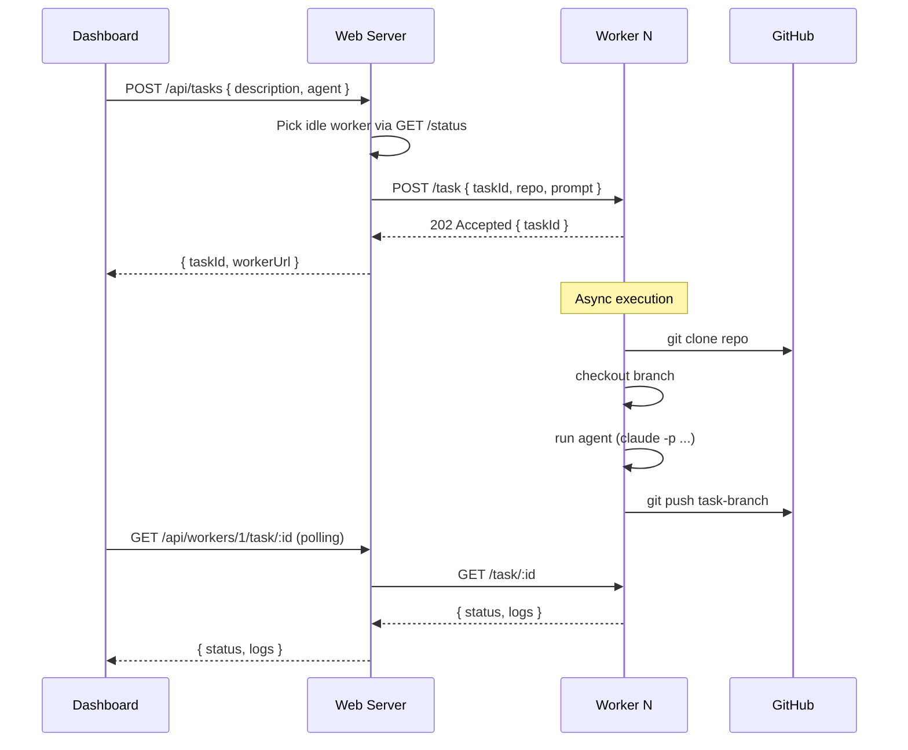

# Plan 4: Railway Worker Pool — Native Agent Execution Without Docker

## Overview

Deploy N pre-defined Railway services as **agent worker nodes** in the same project. Each worker runs AI agents natively in its Railway container (no Docker-in-Docker). The main Rover web service acts as coordinator and task dispatcher.

```mermaid
graph TD
    subgraph Railway Project
        W[Web Dashboard<br/>rover.xaedron.com] -->|dispatch| WK1[Worker 1<br/>rover-worker-1.railway.internal]
        W -->|dispatch| WK2[Worker 2<br/>rover-worker-2.railway.internal]
        W -->|dispatch| WK3[Worker 3<br/>rover-worker-3.railway.internal]
        W -->|dispatch| WK4[Worker 4<br/>rover-worker-4.railway.internal]
        WK1 -->|git push results| GH[GitHub Repo]
        WK2 -->|git push results| GH
        WK3 -->|git push results| GH
        WK4 -->|git push results| GH
    end
    Browser -->|HTTPS| W
```

## Why This Works

Railway services ARE containers. Each worker service:
- Gets its own isolated Linux container ✅
- Has internet access for AI API calls ✅  
- Has a persistent filesystem (within a task lifetime) ✅
- Can run `claude --dangerously-skip-permissions` or `gemini` natively ✅
- Can run `git clone`, `git worktree`, `git push` ✅
- Communicates with other Railway services via **private networking** ✅

The Railway container **is** the sandbox — we don't need Docker-in-Docker.

## Architecture

### Coordinator (packages/web/server.js)
- Maintains registry of worker URLs from env vars
- Dispatches new tasks to idle workers
- Polls workers for status updates
- Aggregates all task state into the dashboard

### Worker (packages/worker/server.js)  
- Accepts one task at a time (or N via concurrency config)
- Clones repo → creates git worktree → runs agent → pushes results
- Exposes REST API for status, logs, stop

### Communication
- Web → Worker: **Railway private network** (`worker-N.railway.internal:3701`)
- Worker → GitHub: HTTPS with `GITHUB_TOKEN`
- Worker → AI APIs: HTTPS with `ANTHROPIC_API_KEY` / `GEMINI_API_KEY`

---

## Implementation

### Step 1: Worker Service Package

Create `packages/worker/` as a new workspace package.

**`packages/worker/package.json`:**
```json
{
  "name": "@endorhq/rover-worker",
  "version": "1.0.0",
  "type": "module",
  "scripts": {
    "dev": "node server.js",
    "start": "node server.js"
  },
  "dependencies": {
    "express": "^5.1.0",
    "cors": "^2.8.5"
  }
}
```

**`packages/worker/server.js`:**

```javascript
import express from 'express';
import { execFile, spawn } from 'node:child_process';
import { existsSync, mkdirSync, rmSync, readFileSync } from 'node:fs';
import { join } from 'node:path';
import { tmpdir } from 'node:os';
import { promisify } from 'node:util';

const execFileAsync = promisify(execFile);
const app = express();
app.use(express.json());

const PORT = process.env.PORT || 3701;
const WORKER_TOKEN = process.env.ROVER_WEB_TOKEN; // reuse same token
const WORKER_ID = process.env.RAILWAY_SERVICE_NAME || 'worker-unknown';

// ── State ────────────────────────────────────────────────────────────────────

const tasks = new Map();     // taskId → task object
let currentTaskId = null;    // null if idle

// ── Auth ─────────────────────────────────────────────────────────────────────

function auth(req, res, next) {
  if (!WORKER_TOKEN) return next();
  const token = (req.headers.authorization || '').replace('Bearer ', '');
  if (token !== WORKER_TOKEN) return res.status(401).json({ error: 'Unauthorized' });
  next();
}

// ── Routes ───────────────────────────────────────────────────────────────────

// Status — is this worker free?
app.get('/status', auth, (req, res) => {
  res.json({
    workerId: WORKER_ID,
    busy: currentTaskId !== null,
    currentTaskId,
    taskCount: tasks.size,
  });
});

// Accept a new task
app.post('/task', auth, async (req, res) => {
  if (currentTaskId !== null) {
    return res.status(409).json({ error: 'Worker busy', currentTaskId });
  }

  const {
    taskId,           // string — Rover task ID (coordinator-assigned)
    repo,             // string — git clone URL (https://github.com/...)
    branch,           // string — base branch to create worktree from
    worktreeBranch,   // string — new branch name for this task
    agent,            // string — 'claude' | 'gemini' | 'codex' etc.
    prompt,           // string — agent prompt / task description
    envVars,          // object — { ANTHROPIC_API_KEY: '...', ... }
  } = req.body;

  if (!taskId || !repo || !prompt) {
    return res.status(400).json({ error: 'Missing required fields: taskId, repo, prompt' });
  }

  // Register task
  const task = {
    id: taskId,
    repo,
    branch: branch || 'main',
    worktreeBranch: worktreeBranch || `rover-task-${taskId}`,
    agent: agent || 'claude',
    prompt,
    status: 'ACCEPTED',
    logs: [],
    startedAt: new Date().toISOString(),
    completedAt: null,
    failedAt: null,
    error: null,
    workDir: null,
  };

  tasks.set(taskId, task);
  currentTaskId = taskId;

  // Run async — don't block the response
  runTask(task, envVars || {}).catch(err => {
    task.status = 'FAILED';
    task.error = err.message;
    task.failedAt = new Date().toISOString();
    currentTaskId = null;
  });

  res.status(202).json({ accepted: true, taskId, workerId: WORKER_ID });
});

// Get task status + logs
app.get('/task/:id', auth, (req, res) => {
  const task = tasks.get(req.params.id);
  if (!task) return res.status(404).json({ error: 'Task not found' });
  res.json(task);
});

// Get task logs only
app.get('/task/:id/logs', auth, (req, res) => {
  const task = tasks.get(req.params.id);
  if (!task) return res.status(404).json({ error: 'Task not found' });
  res.json({ logs: task.logs.join('\n') });
});

// Stop a running task
app.post('/task/:id/stop', auth, (req, res) => {
  const task = tasks.get(req.params.id);
  if (!task) return res.status(404).json({ error: 'Task not found' });
  if (task._process) {
    task._process.kill('SIGTERM');
    task.status = 'STOPPED';
    currentTaskId = null;
  }
  res.json({ stopped: true });
});

// ── Task execution ────────────────────────────────────────────────────────────

async function log(task, line) {
  task.logs.push(`[${new Date().toISOString()}] ${line}`);
  console.log(`[task:${task.id}] ${line}`);
}

async function runTask(task, envVars) {
  const workDir = join(tmpdir(), `rover-${task.id}`);
  task.workDir = workDir;
  task.status = 'CLONING';

  try {
    // 1. Clone the repo
    await log(task, `Cloning ${task.repo}...`);
    mkdirSync(workDir, { recursive: true });
    
    const cloneUrl = task.repo.replace(
      'https://github.com/',
      `https://${process.env.GITHUB_TOKEN}@github.com/`
    );
    
    await execFileAsync('git', ['clone', '--depth=50', cloneUrl, workDir]);
    await log(task, `Cloned successfully`);

    // 2. Checkout base branch and create task branch
    await log(task, `Setting up worktree branch: ${task.worktreeBranch}`);
    await execFileAsync('git', ['checkout', '-B', task.worktreeBranch], { cwd: workDir });
    await log(task, `On branch ${task.worktreeBranch}`);

    // 3. Configure git identity
    await execFileAsync('git', ['config', 'user.email', 'rover-worker@xaedron.com'], { cwd: workDir });
    await execFileAsync('git', ['config', 'user.name', 'Rover Worker'], { cwd: workDir });

    // 4. Install agent CLI if not present
    task.status = 'SETUP';
    await ensureAgentCli(task);

    // 5. Run the agent
    task.status = 'RUNNING';
    await log(task, `Starting ${task.agent} agent...`);
    await runAgent(task, workDir, envVars);

    // 6. Commit and push
    task.status = 'PUSHING';
    await log(task, `Committing changes...`);
    
    const hasChanges = await execFileAsync('git', ['status', '--porcelain'], { cwd: workDir })
      .then(r => r.stdout.trim().length > 0);

    if (hasChanges) {
      await execFileAsync('git', ['add', '-A'], { cwd: workDir });
      await execFileAsync('git', [
        'commit', '-m',
        `rover: complete task ${task.id}\n\nAgent: ${task.agent}\nWorker: ${WORKER_ID}`
      ], { cwd: workDir });

      const pushUrl = task.repo.replace(
        'https://github.com/',
        `https://${process.env.GITHUB_TOKEN}@github.com/`
      );
      await execFileAsync('git', ['push', '-f', pushUrl, task.worktreeBranch], { cwd: workDir });
      await log(task, `Pushed branch ${task.worktreeBranch}`);
    } else {
      await log(task, `No changes to commit`);
    }

    task.status = 'COMPLETED';
    task.completedAt = new Date().toISOString();
    await log(task, `Task completed successfully`);

  } catch (err) {
    task.status = 'FAILED';
    task.error = err.message;
    task.failedAt = new Date().toISOString();
    await log(task, `ERROR: ${err.message}`);
  } finally {
    currentTaskId = null;
    // Cleanup work directory
    try { rmSync(workDir, { recursive: true, force: true }); } catch {}
  }
}

async function ensureAgentCli(task) {
  const bins = {
    claude: 'claude',
    gemini: 'gemini',
    codex: 'codex',
    opencode: 'opencode',
  };
  
  const bin = bins[task.agent] || task.agent;
  
  try {
    await execFileAsync(bin, ['--version']);
    await log(task, `Agent ${bin} found`);
  } catch {
    await log(task, `Installing ${bin}...`);
    const packages = {
      claude: '@anthropic-ai/claude-code',
      gemini: '@google/gemini-cli',
      codex: '@openai/codex',
      opencode: 'opencode-ai',
    };
    const pkg = packages[task.agent];
    if (pkg) {
      await execFileAsync('npm', ['install', '-g', pkg]);
      await log(task, `Installed ${pkg}`);
    }
  }
}

async function runAgent(task, cwd, envVars) {
  return new Promise((resolve, reject) => {
    const agentCommands = {
      claude: ['claude', ['--dangerously-skip-permissions', '-p', task.prompt]],
      gemini: ['gemini', ['-p', task.prompt, '--yolo']],
      codex: ['codex', ['-p', task.prompt]],
      opencode: ['opencode', ['run', task.prompt]],
    };

    const [bin, args] = agentCommands[task.agent] || ['claude', ['--dangerously-skip-permissions', '-p', task.prompt]];

    const env = {
      ...process.env,
      ...envVars,
      HOME: process.env.HOME || '/root',
      // Forward AI API keys from worker env
      ANTHROPIC_API_KEY: process.env.ANTHROPIC_API_KEY,
      GEMINI_API_KEY: process.env.GEMINI_API_KEY,
      GOOGLE_API_KEY: process.env.GOOGLE_API_KEY,
    };

    const proc = spawn(bin, args, { cwd, env, stdio: 'pipe' });
    task._process = proc;

    proc.stdout.on('data', d => task.logs.push(d.toString()));
    proc.stderr.on('data', d => task.logs.push(d.toString()));

    proc.on('close', code => {
      delete task._process;
      if (code === 0 || code === null) {
        resolve();
      } else {
        reject(new Error(`Agent exited with code ${code}`));
      }
    });

    proc.on('error', reject);
  });
}

// ── Start ─────────────────────────────────────────────────────────────────────

app.listen(PORT, () => {
  console.log(`🤖 Rover Worker [${WORKER_ID}] listening on :${PORT}`);
});
```

---

### Step 2: Coordinator Changes to Web Server

Add worker dispatch to [packages/web/server.js](file:///c:/Users/jssca/CascadeProjects/rover/packages/web/server.js):

**Worker Registry** (reads from env vars):
```javascript
// ── Worker Pool ───────────────────────────────────────────────────────────────
// Configure with env vars: WORKER_URLS=https://w1.railway.internal:3701,...
// Or individually:         WORKER_1_URL, WORKER_2_URL, etc.

function getWorkerUrls() {
  if (process.env.WORKER_URLS) {
    return process.env.WORKER_URLS.split(',').map(u => u.trim()).filter(Boolean);
  }
  const urls = [];
  for (let i = 1; i <= 8; i++) {
    const url = process.env[`WORKER_${i}_URL`];
    if (url) urls.push(url);
  }
  return urls;
}

const WORKERS = getWorkerUrls();

async function getIdleWorker() {
  for (const workerUrl of WORKERS) {
    try {
      const res = await fetch(`${workerUrl}/status`, {
        headers: { 'Authorization': `Bearer ${AUTH_TOKEN}` },
        signal: AbortSignal.timeout(3000),
      });
      const status = await res.json();
      if (!status.busy) return workerUrl;
    } catch { /* worker unreachable */ }
  }
  return null; // all busy
}
```

**Modified task creation endpoint** that dispatches to workers:
```javascript
app.post('/api/tasks', authMiddleware, async (req, res) => {
  try {
    const { description, agent, sourceBranch, targetBranch, project, repo } = req.body;
    if (!description) return res.status(400).json({ error: 'description is required' });

    // If workers are configured, dispatch to worker pool
    if (WORKERS.length > 0) {
      const worker = await getIdleWorker();
      if (!worker) {
        return res.status(503).json({ error: 'All workers are busy. Try again shortly.' });
      }

      // Generate a task ID
      const taskId = `task-${Date.now()}`;
      const worktreeBranch = targetBranch || `rover-task-${taskId}`;
      
      const workerRes = await fetch(`${worker}/task`, {
        method: 'POST',
        headers: {
          'Content-Type': 'application/json',
          'Authorization': `Bearer ${AUTH_TOKEN}`,
        },
        body: JSON.stringify({
          taskId,
          repo: repo || process.env.DEFAULT_REPO,
          branch: sourceBranch || 'main',
          worktreeBranch,
          agent: agent || 'claude',
          prompt: description,
        }),
      });
      
      const result = await workerRes.json();
      return res.json({ ...result, taskId, workerUrl: worker });
    }

    // Fallback: local rover CLI (for local dev)
    const args = ['task', '--json', '-y'];
    if (agent) args.push('-a', agent);
    if (sourceBranch) args.push('-s', sourceBranch);
    if (targetBranch) args.push('-t', targetBranch);
    if (project) args.push('--project', project);
    args.push(description);
    res.json(await roverCli(args, { timeout: 300_000 }));

  } catch (err) {
    res.status(500).json({ error: err.message });
  }
});
```

**Worker status aggregation endpoint** (new):
```javascript
app.get('/api/workers', authMiddleware, async (req, res) => {
  const statusPromises = WORKERS.map(async (url, i) => {
    try {
      const r = await fetch(`${url}/status`, {
        headers: { 'Authorization': `Bearer ${AUTH_TOKEN}` },
        signal: AbortSignal.timeout(3000),
      });
      return { id: i + 1, url, ...(await r.json()), online: true };
    } catch {
      return { id: i + 1, url, online: false, busy: false };
    }
  });
  res.json(await Promise.all(statusPromises));
});

app.get('/api/workers/:id/task/:taskId', authMiddleware, async (req, res) => {
  const workerUrl = WORKERS[parseInt(req.params.id) - 1];
  if (!workerUrl) return res.status(404).json({ error: 'Worker not found' });
  try {
    const r = await fetch(`${workerUrl}/task/${req.params.taskId}`, {
      headers: { 'Authorization': `Bearer ${AUTH_TOKEN}` },
      signal: AbortSignal.timeout(5000),
    });
    res.json(await r.json());
  } catch (err) {
    res.status(500).json({ error: err.message });
  }
});
```

---

### Step 3: Railway Deployment

#### Worker [railway.toml](file:///c:/Users/jssca/CascadeProjects/rover/railway.toml) additions

Add workers to the Railway project via their own service config. Each worker is a separate Railway service pointing to the same repo, with `rootDirectory = "packages/worker"`.

Configure in Railway dashboard or via API:
```
Service: rover-worker-1
  Root Directory: packages/worker
  Build: npm install
  Start: node server.js
  Private Port: 3701

Service: rover-worker-2  
  ... (same config)

Service: rover-worker-3
  ... (same config)

Service: rover-worker-4
  ... (same config)
```

#### Environment Variables per Worker

Each worker service needs:
```
ROVER_WEB_TOKEN=<same token as web service>
ANTHROPIC_API_KEY=sk-ant-...        ← for Claude
GEMINI_API_KEY=...                   ← for Gemini (optional)
GITHUB_TOKEN=ghp_...                 ← for cloning/pushing
DEFAULT_REPO=https://github.com/...  ← optional fallback
PORT=3701
```

#### Web Service Environment Variables

Add to the main rover web service:
```
WORKER_1_URL=http://rover-worker-1.railway.internal:3701
WORKER_2_URL=http://rover-worker-2.railway.internal:3701
WORKER_3_URL=http://rover-worker-3.railway.internal:3701
WORKER_4_URL=http://rover-worker-4.railway.internal:3701
```

> [!NOTE]
> Railway private networking uses `.railway.internal` hostnames. These are only accessible between services in the same project. No public URL needed for workers.

---

### Step 4: Task Lifecycle



---

### Step 5: Dashboard UI Updates

Add a **Workers panel** to the dashboard showing worker status:

```html
<!-- In index.html sidebar or topbar -->
<div class="worker-status-bar">
  <span class="worker-badge" id="worker-1">W1 ●</span>
  <span class="worker-badge" id="worker-2">W2 ●</span>
  <span class="worker-badge" id="worker-3">W3 ●</span>
  <span class="worker-badge" id="worker-4">W4 ●</span>
</div>
```

CSS: green dot = idle, amber = busy, grey = offline.

Also update the create-task modal to show worker availability before submitting.

---

## Key Differences from Docker Approach

| Feature | Docker (current) | Railway Workers (new) |
|---------|-----------------|----------------------|
| Isolation | Docker container per task | Railway service per worker |
| Persistence | Ephemeral container | Service restarts between tasks via cleanup |
| Cost | Docker host costs | Railway service compute |
| Concurrency | Unlimited containers | Fixed N workers |
| Setup | Complex (rolldown fails) | Simple Node.js |
| Agent install | Baked into Docker image | `npm install -g` on first use (or pre-baked) |

## Limitations & Mitigations

| Limitation | Mitigation |
|-----------|-----------|
| Fixed concurrency (N workers) | Start with 4; scale up if needed |
| No per-task filesystem isolation | Each task gets unique `tmpdir` + cleanup |
| Agent CLIs must be pre-installed | Cache via Railway's build step |
| Railway private networking required | All within same Rail project ✅ |
| Worker restarts lose in-flight tasks | Task status tracked by coordinator |

## Files to Create/Modify

| File | Action |
|------|--------|
| `packages/worker/server.js` | Create — worker HTTP server |
| `packages/worker/package.json` | Create — worker package config |
| [packages/web/server.js](file:///c:/Users/jssca/CascadeProjects/rover/packages/web/server.js) | Modify — add worker dispatch + `/api/workers` |
| [packages/web/public/app.js](file:///c:/Users/jssca/CascadeProjects/rover/packages/web/public/app.js) | Modify — worker status panel, dispatch to worker API |
| [packages/web/public/index.html](file:///c:/Users/jssca/CascadeProjects/rover/packages/web/public/index.html) | Modify — worker status badges in sidebar |
| [package.json](file:///c:/Users/jssca/CascadeProjects/rover/package.json) (root) | Modify — add `worker` to workspaces and scripts |
| Railway dashboard | Add 4 worker services |

## Acceptance Criteria

- [ ] Worker returns `{ busy: false }` when idle
- [ ] Task dispatch picks an idle worker, returns 503 if all busy
- [ ] Worker clones repo, checks out branch, runs agent, pushes result
- [ ] Dashboard shows worker availability (idle/busy/offline) in real time
- [ ] Task logs stream from worker to dashboard
- [ ] Worker auto-installs agent CLI if missing on first task
- [ ] Completed tasks leave pushes visible on GitHub branch
- [ ] Workers use private Railway networking (not public URLs)
