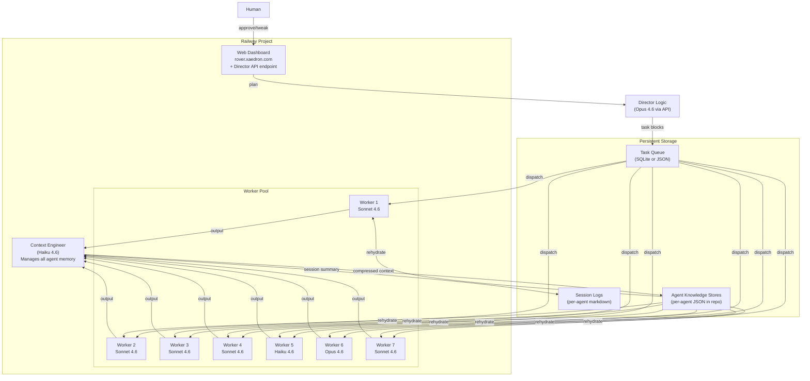
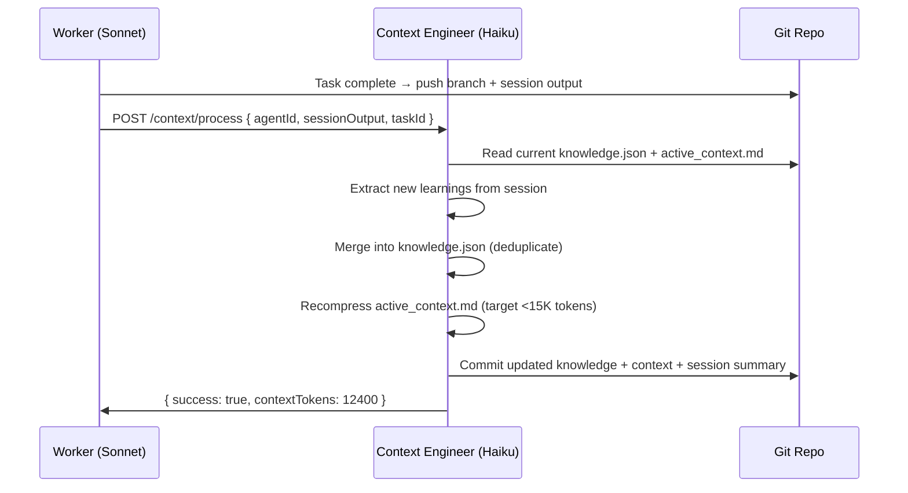
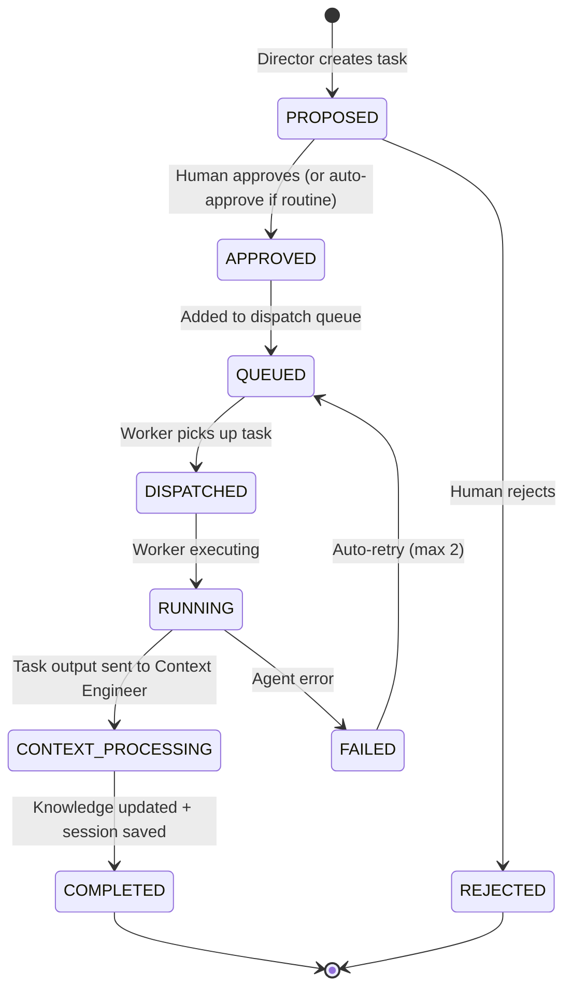

# Plan 5: Rover Constellation — Persistent AI Development Team

## Vision

A team of **persistent, context-aware AI agents** running on Railway, each accumulating domain expertise over time. Agents don't start from scratch — they maintain structured knowledge stores, get context-engineered summaries between sessions, and execute via cost-optimized batch processing. A Director orchestrates work, a Context Engineer manages memory, and humans approve decisions.



---

## Core Architecture

### 1. Agent Identity & Context Persistence

Each agent has a **persistent identity** defined by:

```
.rover/constellation/
├── agents/
│   ├── director/
│   │   ├── charter.md          # Role definition (from your charters)
│   │   ├── knowledge.json      # Accumulated learnings, patterns, gotchas
│   │   ├── active_context.md   # Current working context (what it "knows" right now)
│   │   └── sessions/
│   │       ├── 2026-03-20_plan_auth_module.md
│   │       └── 2026-03-21_review_booking_flow.md
│   ├── coder-backend/
│   │   ├── charter.md
│   │   ├── knowledge.json
│   │   ├── active_context.md
│   │   └── sessions/
│   ├── coder-frontend/
│   │   ├── ...
│   ├── security/
│   │   ├── ...
│   ├── aiml/
│   │   ├── ...
│   ├── docs-prod/
│   │   ├── ...
│   └── whatsapp/
│       ├── ...
├── projects/
│   ├── fpx-laureline/
│   │   ├── config.json         # Repos, team assignments, defaults
│   │   └── task_queue.json     # Pending/approved/running/completed tasks
│   └── other-project/
│       ├── config.json
│       └── task_queue.json
└── config.json                 # Global settings, API keys reference, defaults
```

#### `knowledge.json` — Structured Agent Memory

```json
{
  "agentId": "coder-backend",
  "project": "fpx-laureline",
  "lastActive": "2026-03-20T08:30:00Z",
  "totalTasks": 47,
  "expertise": {
    "modules": ["core", "booking", "payments", "crm"],
    "patterns": [
      "Always use select_related for BookingSpace queries — N+1 trap",
      "MembershipTiers.monthly_price NOT monthly_fee (common field name error)",
      "Stripe webhook handler must verify signature before processing"
    ],
    "gotchas": [
      "Django migration 0042 has a data migration that breaks if run without booking fixtures",
      "Evolution API rate limit: 20 req/s per instance, use exponential backoff"
    ],
    "recentDecisions": [
      { "date": "2026-03-19", "decision": "Use computed properties for tier discounts, not DB fields", "adr": "ADR-0002" }
    ]
  },
  "contextWindow": {
    "lastCompressed": "2026-03-20T06:00:00Z",
    "tokenEstimate": 12400,
    "includes": ["charter", "knowledge", "last_3_sessions", "active_prd_refs"]
  }
}
```

This file is:
- **Written by the Context Engineer** after each task completes
- **Read by the worker** when rehydrating for a new task
- **Stored in the project repo** (committed via git) so it persists across Railway restarts
- **Never read by the Director** (the Director only sees task-level summaries, not full agent memory)

#### `active_context.md` — The Agent's Current "Brain"

```markdown
# Coder Backend — Active Context
Last updated: 2026-03-20T08:30:00Z by Context Engineer

## Current Focus
Payment processing refactor — Stripe webhook reliability improvements.

## Key Knowledge (compressed from 47 sessions)
- Booking model uses `space` FK to `Space`, always prefetch `space__location`
- Payment intents must set `idempotency_key` using `booking.uuid`
- Rate limiting: 100 req/s Stripe, 20 req/s Evolution API
- All timestamps UTC; frontend converts to UTC-6 display

## Active PRD References
- `docs/prd_payments.md` sections 3.2, 4.1 (webhook retry logic)
- `docs/prd_bookings.md` section 2.3 (cancellation flow)

## Recent Session Outcomes
1. [2026-03-19] Fixed Stripe line item names — was showing "Unknown Amenity"
2. [2026-03-18] Added idempotency to payment intent creation
3. [2026-03-17] Refactored webhook handler to use signal-based processing
```

This is the **compressed, engineered context** that the Context Engineer produces. It's what gets loaded into the agent's system prompt when rehydrated. Target: **under 15K tokens** to leave room for the actual task work.

---

### 2. Context Engineer (Haiku)

The Context Engineer is a **special-purpose Haiku agent** that runs automatically after each task completes. Its job:

1. **Read** the full session output from the worker
2. **Extract** new learnings, patterns, gotchas, decisions
3. **Update** `knowledge.json` with new entries (deduplicating)
4. **Compress** `active_context.md` to stay under token budget
5. **Write** a session summary to `sessions/`
6. **Commit** changes to the repo



**Why Haiku?** Context engineering is mechanical summarization work — perfect for the cheapest model. At ~$0.25/MTok input and $1.25/MTok output, processing a 50K-token session output costs about $0.08. Compare to Opus at $15/MTok input — that's 60x cheaper.

**Why a separate agent and not the Director?** Exactly as you said — putting every line of agent output through the Director's Opus context would cost enormously and overwhelm its strategic reasoning. The Context Engineer is a cheap garbage collector that distills signal from noise.

---

### 3. Cost Optimization Stack

#### Layer 1: Anthropic Batch API (50% off)

Since your system runs 24/7 and tasks don't need instant results:

```javascript
// Instead of immediate API calls, queue for batch processing
async function submitBatchTask(agentId, prompt, charter) {
  const batch = await anthropic.batches.create({
    requests: [{
      custom_id: `task-${taskId}`,
      params: {
        model: agentConfig.model,    // e.g., "claude-sonnet-4-6-20250620"
        max_tokens: agentConfig.maxTokens,
        system: charter + activeContext,
        messages: [{ role: "user", content: prompt }],
      }
    }]
  });
  
  // Poll for completion (up to 24h, usually minutes)
  return batch.id;
}
```

**Savings**: 50% on all API costs. A $100/month API bill becomes $50.

#### Layer 2: Prompt Caching (up to 90% on repeated content)

Charters and knowledge stores change slowly. Cache them:

```javascript
const messages = [
  {
    role: "user",
    content: [
      {
        type: "text",
        text: charter,                    // ~3K tokens, rarely changes
        cache_control: { type: "ephemeral" }
      },
      {
        type: "text",
        text: activeContext,              // ~12K tokens, changes per task
        cache_control: { type: "ephemeral" }
      },
      {
        type: "text",
        text: taskPrompt                  // Unique per task
      }
    ]
  }
];
```

**Savings**: Charter (3K tokens) cached = 90% savings on those tokens across all tasks for that agent. Knowledge context (12K tokens) cached = 90% savings if the same agent runs multiple tasks before context changes.

#### Layer 3: Model Tiering

| Task Type | Model | Cost/MTok (input) | Rationale |
|-----------|-------|-------------------|-----------|
| Context engineering | Haiku 4.6 | $0.25 | Mechanical summarization |
| Documentation updates | Haiku 4.6 | $0.25 | Templated, low-creativity work |
| Code implementation | Sonnet 4.6 | $3.00 | Strong coding, good balance |
| Architecture decisions | Opus 4.6 | $15.00 | Complex reasoning, only for Director + AI/ML |
| Security audits | Sonnet 4.6 | $3.00 | Pattern matching, rule-following |

#### Layer 4: Worker Sleep Mode

Railway supports service sleep:

```toml
# Worker railway config
[deploy]
sleepApplication = true  # Sleep after 10 min idle
```

Workers wake in ~5-15 seconds when a task is dispatched. Combined with batch processing, a worker might only be "awake" for the duration of active task execution — typically 5-30 minutes per task.

**Estimated monthly Railway compute**: $5-15/worker × 8 workers = **$40-120/month** (varies by usage).

---

### 4. Task Lifecycle & Approval Queue



#### Auto-Approve Rules

```json
{
  "autoApprove": {
    "priorities": ["P2", "P3"],
    "types": ["bugfix", "docs", "refactor"],
    "agents": ["docs-prod", "context-engineer"],
    "conditions": {
      "maxEstimatedCost": 2.00,
      "maxFilesChanged": 10,
      "requireTests": true
    }
  },
  "requireHumanApproval": {
    "priorities": ["P0", "P1"],
    "types": ["feature", "architecture"],
    "conditions": {
      "touchesPayments": true,
      "touchesMigrations": true,
      "estimatedCostAbove": 5.00
    }
  }
}
```

**P2/P3 bugfixes and docs** → auto-dispatched immediately.
**P0/P1 features, anything touching payments/migrations** → held for human review in the UI.

---

### 5. Worker Suspension & Rehydration

When a worker has been idle for N minutes, Railway sleeps it. When it wakes for a new task:

```
1. Worker wakes (5-15s cold start)
2. Receives task: { agentId, taskId, repo, prompt, ... }
3. Git clone repo (or pull if cached)
4. Read .rover/constellation/agents/{agentId}/active_context.md
5. Read .rover/constellation/agents/{agentId}/charter.md  
6. Construct system prompt: charter + active_context
7. Execute task via Batch API or direct API
8. On completion → send output to Context Engineer
9. Context Engineer updates knowledge.json + active_context.md
10. Worker goes idle → Railway sleep timer starts
```

The **rehydration cost** is one read of `active_context.md` (~12-15K tokens). With prompt caching, repeated rehydrations of the same agent on the same worker cost 90% less after the first load.

---

### 6. UI Controls

#### Agent Configuration Panel

```
┌─────────────────────────────────────────────────────────┐
│ 🤖 Coder Backend                         [Active] [⚙]  │
├─────────────────────────────────────────────────────────┤
│ Model:        [Claude Sonnet 4.6     ▼]  (default)     │
│ Max Tokens:   [8192            ]         (default)     │
│ Thinking:     [Enabled ▼] Budget: [4096]               │
│ Priority:     [Batch (50% off) ▼]                      │
│ Cost Limit:   [$5.00/day] [$100/month]                 │
│ Auto-approve: [P2+ bugfixes, docs  ▼]                  │
│ Repos:        [fpx-laureline ✓] [other-proj ✗]         │
│ Charter:      [View/Edit ▼]                             │
│                                                         │
│ Context: 12,400 tokens │ Tasks: 47 │ Last: 2h ago      │
│ Knowledge: 23 patterns │ 8 gotchas │ 5 decisions       │
└─────────────────────────────────────────────────────────┘
```

#### Defaults (so human can't mess up)

```json
{
  "defaults": {
    "model": "claude-sonnet-4-6-20250620",
    "maxTokens": 8192,
    "thinkingEnabled": true,
    "thinkingBudget": 4096,
    "priority": "batch",
    "costLimitDaily": 10.00,
    "costLimitMonthly": 200.00,
    "autoApprove": "p2_and_below",
    "contextBudget": 15000
  },
  "modelOptions": [
    { "id": "claude-haiku-4-6-20250620", "label": "Haiku 4.6 ($0.25/MTok)", "tier": "economy" },
    { "id": "claude-sonnet-4-6-20250620", "label": "Sonnet 4.6 ($3/MTok)", "tier": "standard" },
    { "id": "claude-opus-4-6-20250620", "label": "Opus 4.6 ($15/MTok)", "tier": "premium" }
  ],
  "priorityOptions": [
    { "id": "batch", "label": "Batch (50% off, up to 24h)", "discount": 0.5 },
    { "id": "standard", "label": "Standard (immediate)", "discount": 0 },
    { "id": "urgent", "label": "Urgent (immediate, no cache)", "discount": 0 }
  ]
}
```

Validation rules prevent bad configs:
- Can't set Haiku for AI/ML Specialist (minimum Sonnet)
- Can't disable thinking for Opus models (waste of money)
- Can't set cost limit below $1/day (tasks would fail constantly)
- Warning if batch mode disabled for non-urgent work

---

### 7. Per-Project Director Isolation

```json
// .rover/constellation/projects/fpx-laureline/config.json
{
  "projectId": "fpx-laureline",
  "name": "FPX Laureline Backend",
  "repos": [
    "https://github.com/owner/fpx-laureline-backend",
    "https://github.com/owner/fpx-laureline-frontend"
  ],
  "director": {
    "model": "claude-opus-4-6-20250620",
    "contextBudget": 20000,
    "prdPaths": ["docs/prd_*.md"],
    "architecturePaths": ["docs/architecture/ADR-*.md"]
  },
  "team": {
    "coder-backend":  { "model": "claude-sonnet-4-6-20250620", "repos": ["*"] },
    "coder-frontend": { "model": "claude-sonnet-4-6-20250620", "repos": ["*-frontend"] },
    "coder-integration": { "model": "claude-sonnet-4-6-20250620", "repos": ["*"] },
    "docs-prod":      { "model": "claude-haiku-4-6-20250620", "repos": ["*"] },
    "security":       { "model": "claude-sonnet-4-6-20250620", "repos": ["*"] },
    "aiml":           { "model": "claude-opus-4-6-20250620", "repos": ["*-backend"] },
    "whatsapp":       { "model": "claude-sonnet-4-6-20250620", "repos": ["*-backend"] }
  },
  "mcp": {
    "laureline-code": {
      "enabled": true,
      "indexPath": ".rover/constellation/index/",
      "autoReindex": "on_task_complete"
    }
  }
}
```

A second project gets its own config, its own Director context, its own agents — completely isolated. No cross-contamination of context or knowledge.

---

### 8. MCP in Workers

Rover's agent container images already support MCP configuration. For workers running natively (no Docker), we configure MCP via the standard `.mcp.json`:

```json
// Generated in workdir before agent execution
{
  "mcpServers": {
    "laureline-code": {
      "command": "python",
      "args": ["-m", "laureline_mcp.server"],
      "env": {
        "REPO_ROOT": "/workspace",
        "EMBED_DB_PATH": "/workspace/.rover/constellation/index/lancedb"
      }
    }
  }
}
```

Workers install Laureline as part of their build step:
```toml
buildCommand = "npm install -g @endorhq/rover@latest && pip install laureline-mcp"
```

All agents get semantic code search via MCP, exactly as your charters specify.

---

## Implementation Phases

### Phase 1: Foundation (Week 1)
- [ ] Create `packages/worker/` with basic HTTP server
- [ ] Create `packages/constellation/` for config + knowledge store schemas
- [ ] Add worker dispatch to web server
- [ ] Deploy 2 test workers on Railway with private networking
- [ ] Basic task dispatch: web → worker → clone → run claude → push
- [ ] Fix health check + complete auth (from earlier work)

### Phase 2: Context Persistence (Week 2)
- [ ] Implement `knowledge.json` + `active_context.md` per agent
- [ ] Build Context Engineer (Haiku endpoint in web service)
- [ ] Post-task context processing pipeline
- [ ] Worker rehydration from knowledge store
- [ ] Session log writing

### Phase 3: Cost Optimization (Week 2-3)
- [ ] Anthropic Batch API integration
- [ ] Prompt caching for charters + knowledge
- [ ] Model tiering per agent role
- [ ] Railway sleep mode for workers
- [ ] Cost tracking per agent (token counts, API costs)

### Phase 4: Director & Approval Queue (Week 3)
- [ ] Director API endpoint (Opus, direct Anthropic API call)
- [ ] Task queue with approval states (PROPOSED → APPROVED → DISPATCHED)
- [ ] Auto-approve rules engine
- [ ] Dashboard: task approval UI
- [ ] Director reads PRDs + generates task blocks

### Phase 5: Full UI (Week 3-4)
- [ ] Agent configuration panel (model, tokens, charter, limits)
- [ ] Worker status dashboard (idle/busy/sleeping/offline)
- [ ] Cost dashboard (per-agent, daily, monthly)
- [ ] Task history with session logs
- [ ] Charter editor

### Phase 6: Full Team Deployment (Week 4)
- [ ] Scale to 7 workers + 1 web service
- [ ] Load all charters from FPX Laureline
- [ ] Configure per-project Director contexts
- [ ] Laureline MCP integration in workers
- [ ] End-to-end test: Director plans → dispatch → execute → context update

---

## File Impact on Rover Source

| Category | Files | Changes |
|----------|-------|---------|
| **Created (new)** | `packages/worker/*`, `packages/constellation/*`, `.rover/constellation/*` | All new |
| **Modified (additive)** | [package.json](file:///c:/Users/jssca/CascadeProjects/rover/package.json) (root) — add workspace entries | 1 line |
| **Modified (ours)** | [packages/web/server.js](file:///c:/Users/jssca/CascadeProjects/rover/packages/web/server.js), `packages/web/public/*` | Already our code |
| **Rover core** | `packages/cli/*`, `packages/core/*`, `packages/agent/*` | **Zero changes** |

---

## Cost Projections

### Railway Compute (monthly)

| Service | Sleep Mode | Est. Cost |
|---------|-----------|-----------|
| Web + Director | Always-on | $7 |
| 7 Workers | Sleep when idle | $3-5 each = $21-35 |
| **Total Railway** | | **$28-42/month** |

### Anthropic API (monthly, with optimizations)

| Optimization | Savings |
|-------------|---------|
| Batch API | -50% on all calls |
| Prompt Caching | -30% average (charters + knowledge cached) |
| Model Tiering | -40% (Haiku for context eng + docs) |
| **Combined** | **~65-70% savings vs naive usage** |

Example: If naive API usage would cost $300/month → optimized cost ≈ **$90-105/month**.

### Total Estimated Monthly: **$120-150** (Railway + API combined)
