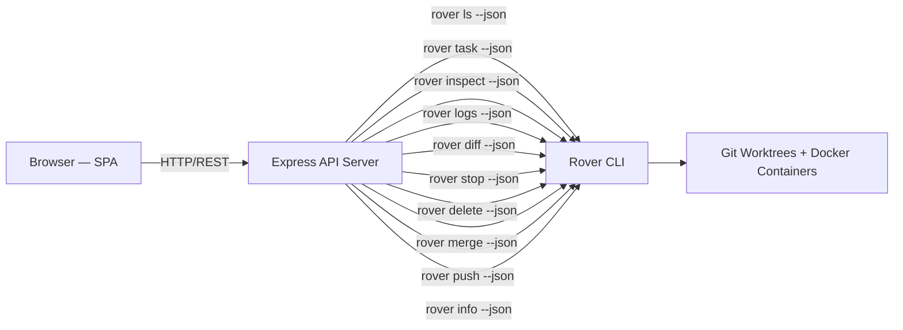

# Rover Web Dashboard — Design & Implementation Plan

## Overview

A minimal but visually polished web frontend for **Rover** — the AI coding agent manager. The dashboard communicates with Rover CLI via a lightweight Express API server that shells out `rover` commands with `--json` flags.

## Architecture



## Core Features (MVP)

| Feature | CLI Equivalent | Description |
|---------|---------------|-------------|
| **Dashboard** | `rover ls --json` | Live task list with status, progress, agent, duration |
| **Create Task** | `rover task --json` | Form to specify description, agent, workflow, source branch |
| **Inspect Task** | `rover inspect --json` | Detailed view of a task with iterations and output files |
| **View Logs** | `rover logs --json` | Scrollable log viewer for a task iteration |
| **View Diff** | `rover diff --json` | Code diff viewer with insertions/deletions |
| **Stop Task** | `rover stop --json` | Stop a running task |
| **Delete Task** | `rover delete --json` | Delete a task and its resources |
| **Merge Task** | `rover merge --json` | Merge task changes into current branch |
| **Push Task** | `rover push --json` | Push task changes to remote |
| **Project Info** | `rover info --json` | Global store info with registered projects |

## Tech Stack

| Layer | Technology |
|-------|-----------|
| Frontend | Vanilla HTML + CSS + JS (single-page app) |
| Backend | Express.js (thin API proxy to CLI) |
| Styling | Vanilla CSS with custom properties, dark theme |
| Bundler | None (development served directly) |

## API Endpoints

```
GET    /api/tasks              → rover ls --json
GET    /api/tasks/:id          → rover inspect :id --json
GET    /api/tasks/:id/logs     → rover logs :id --json
GET    /api/tasks/:id/diff     → rover diff :id --json
POST   /api/tasks              → rover task --json -y -a <agent> "<description>"
POST   /api/tasks/:id/stop     → rover stop :id --json
POST   /api/tasks/:id/delete   → rover delete :id -y --json
POST   /api/tasks/:id/merge    → rover merge :id --json
POST   /api/tasks/:id/push     → rover push :id --json
GET    /api/info               → rover info --json
```

## UI Design

- **Dark theme** with Rover's teal accent (#107e7a)
- **Glassmorphism** cards with subtle backdrop blur
- **Status badges** with color-coded indicators
- **Progress bars** matching CLI's block style
- **Smooth transitions** and micro-animations
- **Responsive layout** — works on desktop and tablet
- **Inter font** from Google Fonts

## File Structure

```
packages/web/
├── package.json
├── server.js           # Express API server
├── public/
│   ├── index.html      # SPA shell
│   ├── styles.css      # Full CSS design system
│   └── app.js          # Frontend SPA logic
```
